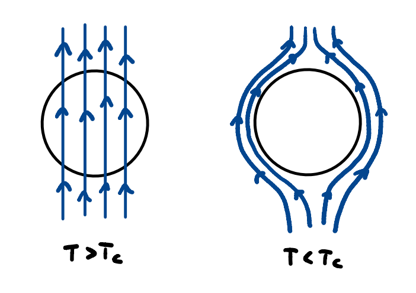
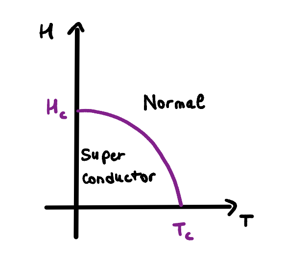
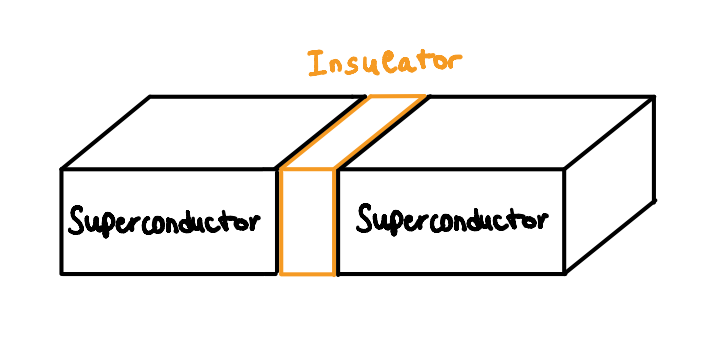
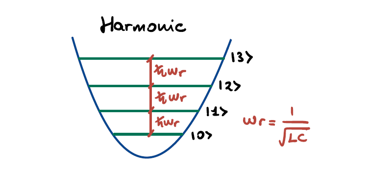
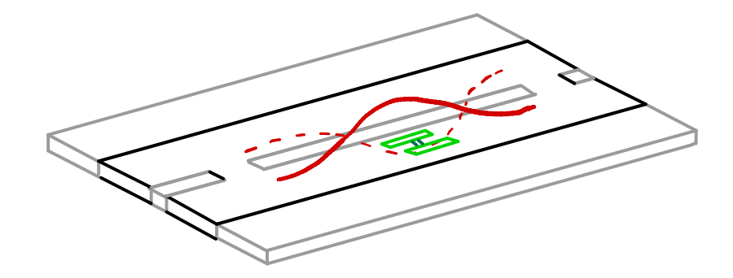
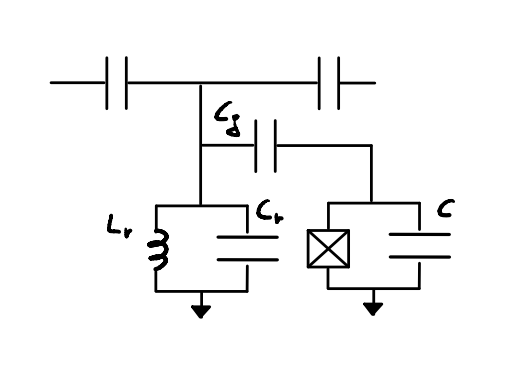
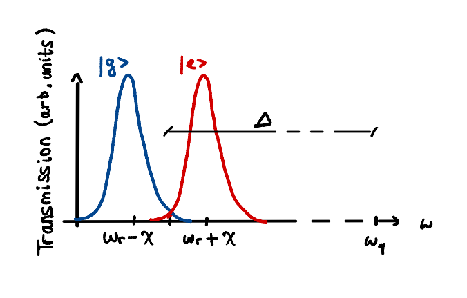
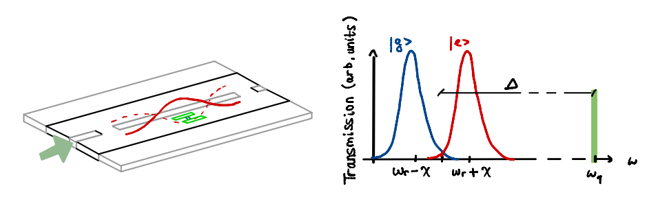

# Introduction

In this first lesson, we - the marvellous Hardware division - will explain you the first theoretical concepts of superconducting quantum computers. 
The article is divided into three sections:
- in the first one, there is a brief discussion about **fundamental concepts of superconductivity**;
- in the second one, we will explain you how to **encode information using superconductivity**;
- lastly, we will talk about the **manipulation of this information**.

Ready to join us? Let's start!

# Theoretical Foundations of Superconductivity

In the pursuit of robust and scalable quantum computing technologies, superconducting circuits have emerged as one of the most promising platforms. Among the various superconducting qubit architectures, the transmon qubit stands out for its balance between coherence, tunability, and scalability. At the heart of this design lies the phenomenon of superconductivity, a macroscopic quantum state that allows the creation of circuit elements like Josephson junctions, essential components for transmon operations. To fully grasp the principles behind transmon qubits, one must first understand the fundamental physics of superconductivity.

## Superconductivity

### Lossless Conduction and Meissner Effect
Superconductivity is a state in which a material exhibits zero electrical resistance below a critical temperature $T_c$. This lossless conduction is not simply an extension of ideal conductivity, but rather a manifestation of a new quantum phase of matter. Additionally, superconductors expel magnetic fields from their interior (the Meissner effect), a distinctive trait that sets them apart from perfect conductors.

### Critical Quantities
A superconducting material transits to its normal (resistive) state when subjected to:
- Temperatures above $T_c$
- Magnetic fields exceeding the critical magnetic field **$H_c (T)$**
- Currents above a critical current *$I_c$*

The temperature dependence of the critical field is given by the empirical law:

$$
\begin{aligned}
H = H_{c_0} \cdot \left(1 - \left(\frac{T}{T_{c}}\right)^2 \right)
\end{aligned}
$$

and according to Ampère's Law, this critical field relates to the maximum current sustainable by the material, wich is:
*$I_c = 2 \pi R H_c$*

### Charge carriers in superconductors
In the superconducting state, conduction electrons form bound pairs known as **Cooper pairs**, which behave as **bosons**. Coupling mechanisms are different, here we'll deal for simplicity with the phonon coupling, the easiest - nonethless the only one analytically described by BCS theory. It works in this way: as an electron moves through the lattice, it distorts it due to Coulomb attraction with the lattice's ions, creating a local positive potential that attracts another electron.

Because these pairs have integer spin, they do not follow the Pauli exclusion principle and can condense into a single quantum state, leading to the macroscopic coherence of the superconducting phase.

### Macroscopic Wave Function
Each Cooper pair contributes to a collective quantum state described by a macroscopic wave function:

*$\Psi(r, t) = \Psi_0 \cdot e^{-j(\omega t + \phi)}$*

This wavefunction is extended to the entire superconductor and its phase *$\phi$* becomes a key player in superconducting circuit dynamics, since it's related to the external magnetic field acting on the junction, as we are going to see in a while.

## Josephson Junction and Josephson Effect
A **Josephson Junction** (**JJ**) consists of two superconductors separated by a thin insulating layer. Due to the tunnel effect of the macroscopic wavefunction, a supercurrent can flow through this insulator, a phenomenon known as the Josephson effect.

 Importantly, it's not individual Cooper pairs but the macroscopic wavefunctions that interfere and allow for the current:
*$ I = I_c \cdot \sin(\phi) $*

Where *$\phi = \phi_2 - \phi_1$* is the phase difference across the junction, referred to the phase of the two wavefunctions defined respectively for the two superconducting sides of the JJ.\
This nonlinear relationship is responsable for the JJ behaviour of **nonlinear inductor**, with an effective inductance:

$$
\begin{aligned}
L(\phi) = \frac{\Phi_0}{2 \pi I_c \cos(\phi)}
\end{aligned}
$$

with 

$L_j = (\Phi_0)/(2 \pi I_c)$

defined as the **Josephson inductance**

Here,  
*$\Phi_0 = \frac{h}{2e} \approx 2.07 \times 10^{-15} Wb$* is the **magnetic flux quantum**, i.e. a costant that referres to the smallest quanta of magnetic flux we can consider. 

### Energy Considerations
The Josephson junction stores energy as:
*$E(\phi) = E_J \cdot (1 - \cos(\phi))$*

Where: *$E_J = \frac{I_c \Phi_0}{2 \pi}$* is the *Josephson energy*. This energy landscape is periodic with the phase difference defined above, and can be tuned by an external magnetic field acting on the JJ - as we're going to see in a while. 

### Voltage – Phase and Flux Relations
From the relation between voltage $V$ and the phase difference $\phi$:

$ \frac{d \phi}{d t} = \frac{2 \pi V}{\Phi_0} $ 

we can define the quantity electric flux $\Phi$ as:

$ \Phi = \int_0^t V(t') d t' = \frac{\Phi_0}{2 \pi}(\phi - \phi_0) $

from which we can express *$\phi= \frac{2\pi \Phi}{\Phi_0} + \phi_0$*

[//]: # (This makes the phase difference directly linked to the total flux acting on the JJ. In practice - this will be seen in the following sections of the article - when we have an external magnetic flux this has to be summed to this electrical one, affecting the phase difference, and so, tuning the value of the energy referred to the JJ. This is going to be a fondamental feature of our transmon qubit, since it is essentially described by a quantum harmonic oscillator, circuitally represented by an LC resonator, where we introduce an unharmonicity by means of a JJ, substituted to the linear inductance since it behaves like a nonlinear one. This is done on purpose, since in this way we have no more energy levels that are evenly spaced - as in a quantum harmonic oscillator - and we can play on the energy of the JJ by means of an external magnetic field in order to isolate two energy levels from the others, in so to have our two levels system to be used as a qubit.
)

# Superconducting qubits: from the LC-Circuit to the Transmon Qubit

Now that we gave a look at the physics of superconductivity we'll see how we can use it to build a quantum unit of information. 
Starting from classic circuitry we are going to build the structures where Cooper pairs will be used as carriers of information.

### Qubit review

We'll start with a basic review of said quantum unit of information, the **quantum bit** or **qubit**.
In classical theory of information, the basic unit of measurement is the **binary digit**, or **bit**, which can take on one of two values, either 0 or 1. 
Its quantum counterpart is the qubit which thanks to the **superposition of states**, a mere result of the founding mathematics of quantum mechanics, can hold information equal to all  infinite combinations of 0 and 1. Physically, a qubit is a two-level system which can be manipulated and read differently based on the technology used to implement it. Using Dirac's notation we can define a qubit as:

$$
\begin{aligned}
\Psi = \alpha\ket{0} + \beta\ket{1}
\end{aligned}
$$

Where $\alpha$ and $\beta$ are complex numbers that must fulfill the relation:

$|\alpha|^2+|\beta|^2 = 1$ 

 
## LC circuits and Transmission Lines
Having in mind the objective of building a qubit out of superconducting circuitry we'll start by studying a basic yet fundamental electric circuit which is at the foundations of both the qubit itself and its manipulation system.

### LC circuit

This simple LC circuit is made by a parallel of an inductor and a capacitor. It acts as an electrical resonator storing energy by oscillating at the circuit's resonant frequency.
The energy is divided between the charge inside the capacitor and the magnetic field formed inside the inductor by the passing current and can be described by the following Hamiltonian:

$$
\begin{aligned}
H = \frac{Q^2}{2C} + \frac{\Phi^2}{2L}
\end{aligned}
$$

Due to the quadratic form of the energy, the potential landscape inside such a circuit is parabolic. 

By applying the circuit quantization procedure one obtaines the Hamiltonian of the **quantum harmonic oscillator** with discrete allowed energies arising in the potential profile. The Hamiltonian of the quantum harmonic oscillator can be rewritten through the creation and annhilition operators formalism as:

$$
\begin{aligned}
\hat{H} = \hbar w_r \left( \hat{a}^ \dagger \hat{a} + \frac{1}{2}\right)
\end{aligned}
$$

Notice that the harmonicity causes the jumps in energy to be all equal to $\hbar w_r$ with $w_r = \frac{1}{\sqrt{L C}}$ being the circuit's resonant frequency.

### Transmission Line

The transmission line is a model for circuits that transport electromagnetic energy without significant losses. It can be schematized as a lumped-element model composed of an array of coupled LC circuits. 
By shorting both ends of the transmission line to the ground one obtains a proper resonator where the admitted wavevectors are discretized as: 

$k = {2 \pi n}/L$ 

with L being the resonator lenght and $n = 1, 2, 3...$

The Hamiltonian can be again be written in terms of creation and annihilation operators which create and annihilate a wave with wavevector $k$:

$$
\begin{aligned}
\hat{H} = \sum_{n=0} \hbar w_n [\hat{a}(w_n)^ \dagger \hat{a}(w_n)]
\end{aligned}
$$

with $w_n = (n+1) w_r$ being the frequencies of the admitted modes.
The concept of the transmission line as a resonator will come useful in the following parts when it will be used to read the state of the qubit by capacitive coupling.

## Superconducting qubits
Using the concepts illustrated above we'll now move toward building a superconducting qubit. For this goal we'll need to merge classical electronic concepts like the LC circuit with a bit of superconducting magic.

### Artificial atoms
When using a technology to make a qubit we need to keep in mind how we want this to behave. The concept of **artificial atoms** is the model that precisely describes the desired characteristics of the qubit in the making.
We basically want our physical system to behave like a natural atom, with its inhomogeneous and descrete energy jumps which can be controlled by accurately sending some sort of signals and likewise be easily read.
What we aim for are sharp energy levels and anharmonic transitions so that a signal tuned at the difference between two energy levels will address only that one and other energy jumps will be transparent to it.

In the case of qubits as artificial atoms we would mostly like the carriers of information, in our case Cooper pairs, to hold the information for long times which in this framework can be said to aspire to long *coherence times*. 
It is also fundamental to avoid thermal fluctuations with energies higher than the addressed transition, so that undesired excitations are avoided. Finally, the major risk of decoherence by enviromental influences must be contained adequately.

### Charge Qubits
Let's take now the LC circuit described above and let's replace the linear inductor with a Josephson junction. What we will get is the first form of superconducting qubit we can regard, also called a *charge qubit*.

The charge qubit is simply made by a Josephson junction shunted by a capacitor. The core difference with respect to a normal LC circuit is the **non-linear behavior** of the junction. The capacitor connecting the source to the junction symbolizes the capacitive coupling of the qubit to an arbitrary voltage source.
The sinusoidal characteristic of the junction current gives rise to an anharmonic profile in its potential:

$$
\begin{aligned}
\hat{H} = 4E_c \hat{n}^2 - E_j cos(\phi)
\end{aligned}
$$

where $\hat{n}$ is the **number operator** which is directly linked to the creation and annihilation operators and represents the number of Cooper pairs inside the circuit, $E_c$ is the **charging energy** that has an inverse proportionality with respect to the shunting capacitor and $E_j$ is the **Josephson energy** while $\phi$ is the phase difference of the macroscopic wavefunction across the junction.

The quadratic behavior of the energy now lies entirely in the number operator while the **non-linear potential** of the junction gives rise to anharmonic jumps inside its profile.

Thanks to the anharmonicity of the potential, the descrete energy transitions accessible in a quantum framework are now uneven allowing to **address two states independently**.

### Transmon Regime

Historically, the first implementations of superconducting qubits were charge qubits where the information is encoded in the amount of Cooper pairs inside the superconducting circuit. The main source of noise that degrades such systems is *charge noise* which is due to nearby charges driven by the voltage source that the qubit might collect. They're modellable as a parametric fluctuation ($n_g$) in the number of carriers in the Hamiltonian:

$$
\begin{aligned}
\hat{H} = 4E_c (\hat{n}^2-n_g^2) - E_j cos(\phi)
\end{aligned}
$$

the fluctuation might even change with time.
The main consequence of charge noise is to change the transition frequencies making it almost impossible to control the qubit.

In order to mitigate the influence of this kind of noise the Josephson energy must overcome the charging energy. Implementing a Superconducting Quantum Interference Device (SQUID) to tune $E_j$ or enlarging the capacitor area to lower $E_c$ are valid ways to control the $E_j/E_c$ ratio.

The image above shows the ratio between the energy levels with respect to the ground state energy as a function of noise charge. It is evident that with low values of $E_j/E_c$ small variations of $n_g$ lead to catastrophical change in energy differences.
When $E_j/E_c$ is in the $20-80$ range the qubit is said to be in **transmon regime** and sensitivity to charge fluctuations is almost completely supressed. Notice that also the anharmonicity in the transition is lowered with higher values of $E_j/E_c$ but in a slower way so that the qubit is still regardable as a quantum anharmonic oscillator.

By being in transmon regime, neglecting so the noise charge term in the Hamiltonian, and by expressing the energy with creation and annihilation operators, this final form is found:

$\hat{H} = \hbar w_q \hat{b}^\dagger \hat{b} - E_c/\hat{b}^\dagger\hat{b}^\dagger \hat{b}\hat{b}$

where $\hbar w_q = \sqrt{8 E_c E_j} - E_c$ is the **corrected transmon frequency** and refers to the first energy transition in the spectrum.

# Technological implementation

##  The Jaynes - Cummings model
Now that we have built our atom, there are some important problems to be solved: **how** can we **control the quantum state** without disrupting it? How can we perform the projective measurements? Before talking about this, we have to make a step back, using a parallelism to understand better our physical system. 

We know that, if we transmit a laser beam towards an atom at the right frequency, we can excite its state, by promoting the orbiting electron to an higher energetic level.  
This model is described by the so-called **Jaynes - Cummings** hamiltonian:

$$
\begin{aligned}
 \hat H_{JC} = \omega_r \hat a^\dagger \hat a + \frac{\omega_{01}}{2} \hat\sigma_z + g (\hat a^\dagger \hat\sigma_- + \hat a \hat\sigma_+) 
\end{aligned}
$$

The light-matter interaction is well described into the third element:
+ the de-excitation of the atom brings the creation of a photon
+ "sacrificing" a photon means to excite the atom

This atomic level control can be well performed inside an optic resonator.  
A resonator is a structure that is able to select certain wave frequencies to resonate in a system. For example, take a guitar: its strings emits certain notes because we select a certain length, by pressing the strings on its surface.

A notorious example in physics is the **Fabry - Perot cavity**, used for building lasers: if we put two mirrors in front of each other at a certain distance, only few frequencies of electromagnetic waves will oscillate between them. Putting **an atom** inside the Febry - Perot cavity permits us to control it using certain frequencies.

Let's do the same for our transmon qubit: if we put it inside a resonator made of **superconducting transmission lines**, we'll be able to control or measure it.

To prove this, let's examine the equivalent circuit of this system, to derive its hamiltonian. The technique of studying quantum systems by analyzing its equivalent circuit is called Circuit Quantum Electrodynamics (QED).

The derivation of this circuit is straightforward: 
+ the resonator is represented by an harmonic oscillator (LC circuit)
+ the qubit is represented by an anharmonic oscillator (JJ + C circuit)
+ the coupling between the two is represented by a capacitance ($C_g$)

The hamiltonian corresponding to this circuit is: 

$$
\begin{aligned}
 \hat H = (\frac{\hat Q^2_r}{2C_r} +\frac{\hat \Phi ^2_r}{
 2 L_r}) + (4 E_c \hat n^2 - E_j cos \hat \phi)
\end{aligned}
$$

that, with some approximations, is equivalent to the Jayes - Cummings model.

So, *we can control the information stored into a qubit with electromagnetic waves as we can control an atom with a laser*! Cool, right?

## The dispersive regime

Now that our model is ready to be used, there is an important problem to solve: how can we modify the state of the qubit without disrupting it?

We know from the basilar concepts of quantum physics that entering in contact with a quantum system brings its collapse, but we still need to find a way to modify its information and to create a useful computer.

The solution here is achieved in the **Dispersive regime**: the main idea is to use two different frequencies, one for control ($\omega_{01}$)and one for readout ($\omega_r$), in order to make two distinguished operations on the qubit.

If we choose these two frequencies such that:

$$
\begin{aligned}
\Delta = | \omega_{q}-\omega_r| >> g
\end{aligned}
$$
 

the Jaynes -  Cummings hamiltonian can be approximated to:
$$
\hat H_{disp} = (\omega_r + \chi \hat \sigma_z) \hat a^\dagger \hat a + \frac{\omega_{q}}{2}\hat \sigma_z
$$
 

(with $\chi \approx \frac{g^2}{\Delta} $).

This has two direct consequences:
+ if $\sigma_z$ **eigenvalue** is **+1** (the qubit is in excited state), the resonance frequency of the resonator will become $\omega_r + \chi$

+ if $\sigma_z$ **eigenvalue** is **-1** (the qubit is in ground state), the resonance frequency of the resonator will become $\omega_r - \chi$

This means that the qubit state affects the system around it.

As we can appreciate from this image, $\omega_q$ and $\omega_r$ are distant from each other! It seems like measurement and control are two very different things...

It's time to use this system!

+ **measurement**: probe the resonator at frequency $\omega_r$; depending on the qubit state, the transmission frequency will be at $\omega_r + \chi$ or $\omega_r - \chi$

+ **control**: probe the resonator at $\omega_q$ with the waveform you need to rotate the state of the qubit

## Qubit control

But what do we exactly mean with "qubit state rotation"? How is it possible to do that with resonating frequencies?

Before talking about that, we need to make a brief recap about an important topic in signal analysis: the **I/Q modulation**.

A signal (a general waveform, like a sinusoidal wafe) can be decomposed into two additive components:
+ an **In-Phase (I)** signal, which will have zero phase
+ a **Quadrature (Q)** signal, with $\frac{\pi}{2}$ phase

A fixed - frequency signal can also be represented as a dot in a complex plane, whose axis label the I and Q components that constitute it.

Using again the QED technique, we derive the hamiltonian of the **driving voltage** and controlled qubit system:

$$
\begin{aligned}
\hat H_d = \Omega V_0 s(t) (I \sigma_x + Q \sigma_y)
\end{aligned}
$$
 

where: 
+ $\Omega = \frac{C_d}{C_\Sigma} Q_0$ (equivalent circuit related constant)
+ $V_0$ is the generated voltage amplitude
+ $s(t)$ is the signal waveform

The main idea is to modulate I and Q components of the driving signal in order to select a qubit x or y rotation.

So we mainly have two cases:

+ if **Q = 0**, we will achieve the **rotation around the x axis**
+ if **I = 0**, we will achieve the **rotation around the y axis**

The **z rotation** case is different; indeed, the z gate is said to be **virtual**, since we cannot perform a direct z rotation, but only adjust the signal phase in order to transform its I and Q components:

$I' = I \cos \phi - Q \sin \phi $

$Q' = I \sin \phi - Q \cos \phi $

In all 3 cases, the rotation angle is bound to the duration of the driving signal.

# That's all, folks!

So, with this article, we explained you:
+ what is **superconductivity**;
+ what is a **transmon qubit**;
+ the **first building stages** of a superconductive quantum computer.

If you liked this article, please share it with other Quantum-enthusiasts!