# Introduzione

In questa prima lezione, noi della divisione Hardware vi spiegheremo i primi concetti teorici alla base del funzionamento dei computer quantistici superconduttori. 
L'articolo è diviso in tre sezioni:
- nella prima, ci sarà una breve discussione sui **concetti fondamentali della superconduttività**;
- nella seconda, vi spiegheremo come **codificare le informazioni utilizzando la superconduttività**;
- infine, parleremo di come poter **manipolare queste informazioni**.

Siete pronti? Iniziamo!

# Fondamenti teorici della superconduttività

Nella ricerca di tecnologie di computer quantistici, i circuiti superconduttori sono emersi come una delle piattaforme più promettenti. Tra le varie architetture di qubit superconduttori, il qubit transmon si distingue per il suo equilibrio tra coerenza e scalabilità. Alla base di questo progetto c'è il fenomeno della superconduttività, uno stato quantistico macroscopico che permette la creazione di elementi circuitali come le giunzioni Josephson, componenti essenziali per le operazioni transmon. Per comprendere appieno i principi alla base dei qubit transmon, occorre innanzitutto capire la fisica fondamentale della superconduttività.

## Superconduttività

### Conduzione senza perdite ed effetto Meissner
La superconduttività è uno stato in cui un materiale presenta una resistenza elettrica nulla al di sotto di una temperatura critica $T_c$. Questa conduzione senza perdite non è semplicemente un'estensione della conduttività ideale, ma piuttosto una manifestazione di una nuova fase quantistica della materia. Inoltre, i superconduttori espellono i campi magnetici dal loro interno (effetto Meissner), una caratteristica distintiva che li differenzia dai conduttori perfetti.

<!--  -->
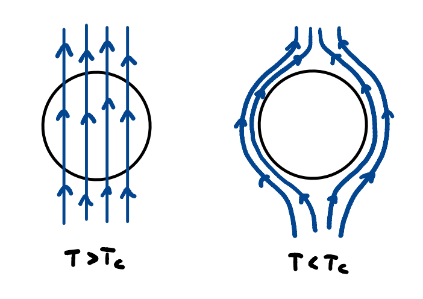

### Quantità critiche
Un materiale superconduttore passa allo stato normale (resistivo) quando è sottoposto a:
- Temperature superiori a $T_c$
- Campi magnetici superiori al campo magnetico critico **$H_c (T)$**
- Correnti superiori a una corrente critica *$I_c$*

La dipendenza dalla temperatura del campo critico è data dalla legge empirica:

$$
\begin{aligned}
H = H_{c_0} \cdot \left(1 - \left(\frac{T}{T_{c}}\right)^2 \right)
\end{aligned}
$$

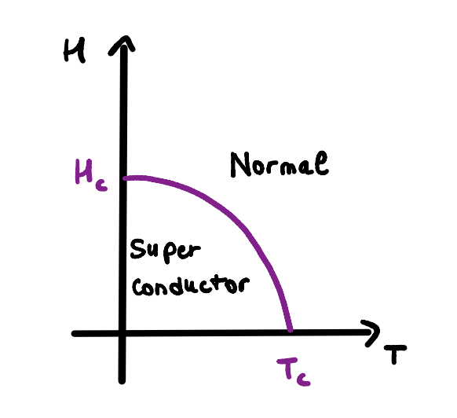

e secondo la legge di Ampère, questo campo critico è correlato alla massima corrente sostenibile dal materiale, che è:
*$I_c = 2 \pi R H_c$*

### Portatori di carica nei superconduttori
Nello stato superconduttivo, gli elettroni di conduzione formano coppie legate note come **coppie di Cooper**, che si comportano come **bosoni**. I meccanismi di accoppiamento sono diversi, in questa sede ci occuperemo per semplicità dell'accoppiamento fonico, il più semplice - nondimeno l'unico analiticamente descritto dalla teoria BCS. Funziona così: quando un elettrone si muove nel reticolo, lo distorce a causa dell'attrazione coulombiana con gli ioni del reticolo, creando un potenziale positivo locale che attrae un altro elettrone.

Poiché queste coppie hanno spin intero, non seguono il principio di esclusione di Pauli e possono condensarsi in un singolo stato quantistico, portando alla coerenza macroscopica della fase superconduttiva.

### Funzione d'onda macroscopica
Ogni coppia di Cooper contribuisce a uno stato quantico collettivo descritto da una funzione d'onda macroscopica:

*$\Psi(r, t) = \Psi_0 \cdot e^{-j(\omega t + \phi)}$*

Questa funzione d'onda viene estesa all'intero superconduttore e la sua fase *$\phi$* diventa un elemento chiave nella dinamica dei circuiti superconduttori, poiché è legata al campo magnetico esterno che agisce sulla giunzione, come vedremo tra poco.

## Giunzione Josephson ed effetto Josephson
Una **giunzione Josephson** (**JJ**) è costituita da due superconduttori separati da un sottile strato isolante. A causa dell'effetto tunnel della funzione d'onda macroscopica, una supercorrente può fluire attraverso questo isolante, un fenomeno noto come effetto Josephson.

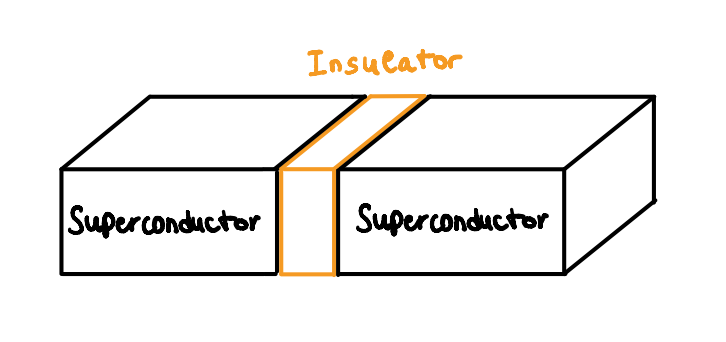

 È importante notare che non sono le singole coppie di Cooper, ma le funzioni d'onda macroscopiche a interferire e a consentire la corrente:
*$ I = I_c \cdot \sin(\phi) $*

Dove *$\phi = \phi_2 - \phi_1$* è la differenza di fase attraverso la giunzione, riferita alla fase delle due funzioni d'onda definite rispettivamente per i due lati superconduttori della JJ.\
Questa relazione non lineare è responsabile del comportamento della JJ come **induttore non lineare**, con un'induttanza effettiva:

$$
\begin{aligned}
L(\phi) = \frac{\Phi_0}{2 \pi I_c \cos(\phi)}
\end{aligned}
$$

con 

*$L_j = (\Phi_0)/(2 \pi I_c)$*

definita come **induttanza di Josephson**

  
*$\Phi_0 = \frac{h}{2e} \approx 2,07 \times 10^{-15} Wb$* è il **quanto di flusso magnetico**, cioè una costante che si riferisce ai più piccoli quanti di flusso magnetico che possiamo considerare. 

### Considerazioni sull'energia
La giunzione Josephson immagazzina energia come:
*$E(\phi) = E_J \cdot (1 - \cos(\phi))$*

Dove: *$E_J = \frac{I_c \Phi_0}{2 \pi}$* è la *energia Josephson*. Questo valore è periodico rispetto alla differenza di fase definita sopra e può essere regolato da un campo magnetico esterno che agisce sulla JJ, come vedremo tra poco. 

### Relazioni tensione-fase e flusso
Dalla relazione tra la tensione $V$ e la differenza di fase $\phi$:

*$(d \phi)/(d t) = (2 \pi V)/(\Phi_0) $*

possiamo definire la quantità di flusso elettrico $\Phi$ come:

$ \Phi = \int_0^t V(t') d t' = \frac{\Phi_0}{2 \pi}(\phi - \phi_0) $

da cui possiamo esprimere *$\phi= 2\pi \Phi/(\Phi_0) + \phi_0$*

Ciò rende la differenza di fase direttamente legata al flusso totale che agisce sulla JJ. 

[//]: # (In pratica - lo vedremo nelle sezioni successive dell'articolo - quando abbiamo un flusso magnetico esterno, questo deve essere sommato al flusso elettrico, influenzando la differenza di fase e, quindi, sintonizzando il valore dell'energia riferita alla JJ)

[//]: # (Questa sarà una caratteristica fondamentale del nostro qubit
transmon, poiché è essenzialmente descritto da un oscillatore armonico quantistico, rappresentato circuitalmente da un risonatore LC, in cui introduciamo un'inarmonicità per mezzo di una JJ, sostituita all'induttanza lineare poiché si comporta come una non lineare. Questo è fatto apposta, perché in questo modo non abbiamo più livelli energetici equidistanti - come in un oscillatore armonico quantistico - e possiamo giocare sull'energia del JJ per mezzo di un campo magnetico esterno in modo da isolare due livelli energetici dagli altri, in modo da avere il nostro sistema a due livelli da usare come un qubit.)

# Qubit a superconduttore: dal Circuito LC al Transmon Qubit

Dopo aver dato uno sguardo alla fisica della superconduttività, vediamo come utilizzarla per costruire un'unità di informazione quantistica. 
Partendo da circuiti classici, costruiremo strutture in cui le coppie di Cooper sono utilizzate come portatrici di informazione grazie alla loro presenza.

### Review del Qubit

Cominceremo con un ripasso della basilare unità di informazione quantistica, il **quantum bit** o **qubit**.
Nella teoria classica dell'informazione, l'unità di misura più elementare è il **binary digit**, o **bit**, che può assumere uno dei due valori 0 o 1. 
La sua controparte quantistica è il qubit che, grazie alla **superposizione degli stati**, un semplice risultato della matematica fondante della meccanica quantistica, può assumere valori pari a tutte le infinite combinazioni di 0 e 1. Fisicamente, un qubit è un sistema a due livelli che può essere manipolato e letto in modo diverso a seconda della tecnologia usata per implementarlo. Utilizzando la notazione di Dirac, possiamo definire un qubit come:

$$
\begin{aligned}
\Psi = \alpha\ket{0} + \beta\ket{1}
\end{aligned}
$$

Dove $\alpha$ e $\beta$ sono numeri complessi che devono soddisfare la relazione:

$|\alpha|^2 + |\beta|^2 = 1 $ 

## Circuiti LC e linee di trasmissione
Avendo in mente l'obbiettivo di costruire un qubit con circuiti superconduttori, cominceremo a studiare un circuito elettrico fondamentale che è alla base sia del qubit stesso sia del suo sistema di manipolazione.

### Circuito LC

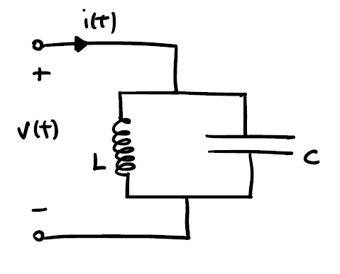

Questo semplice circuito LC è costituito da un parallelo di un induttore e di un condensatore. Agisce come un risonatore che immagazzina energia oscillando alla sua frequenza di risonanza.
L'energia è divisa tra la carica all'interno del condensatore e il campo magnetico formato all'interno dell'induttore dalla corrente passante e può essere descritta dalla seguente Hamiltoniana:

$$
\begin{aligned}
H = \frac{Q^2}{2C} + \frac{\Phi^2}{2L}
\end{aligned}
$$

A causa della forma quadratica dell'energia, il potenziale all'interno di tale circuito è parabolico. 

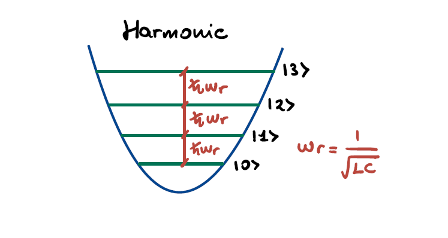

Applicando quindi la quantizzazione del circuito si ottiene l'Hamiltoniana dell'**oscillatore armonico quantistico** con energie accessibili discrete derivanti dal profilo del potenziale. L'Hamiltoniana dell'oscillatore armonico quantistico può essere riscritta attraverso il formalismo degli operatori di creazione e annichilazione come:

$\hat{H} = \hbar w_r ( \hat{a} ^ \dagger \hat{a} + \frac{1}{2})$

Si noti che l'armonicità fa sì che i salti di energia siano tutti pari a $\hbar w_r$ con $w_r = \frac{1}{\sqrt{L C}}$ uguale alla frequenza di risonanza del circuito.

### Linea di trasmissione

La linea di trasmissione è un modello di circuito che trasporta energia elettromagnetica senza perdite significative. Può essere schematizzata come un modello a elementi concetrati composto da un array di circuiti LC accoppiati. 
Cortocircuitando entrambe le estremità della linea di trasmissione verso massa si ottiene un vero e proprio risonatore in cui i vettori d'onda ammessi sono discretizzati come:

$k = {2 \pi n}/L$ 

con L uguale alla lunghezza del risonatore e $n = 1, 2, 3...$

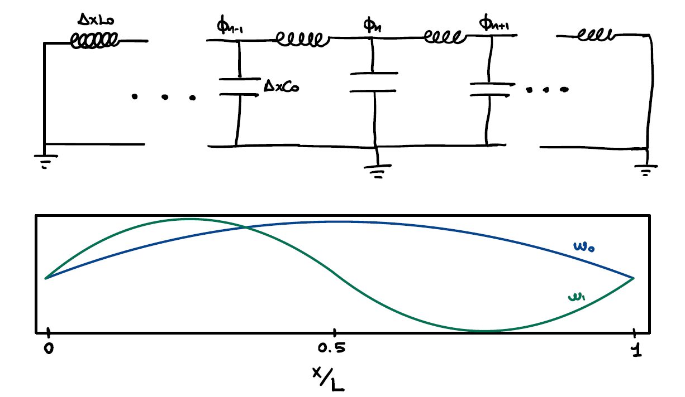

L'Hamiltoniana può essere nuovamente scritta in termini di operatori di creazione e annichilazione che creano e distruggono un'onda con vettore d'onda $k$:

$$
\begin{aligned}
\hat{H} = \sum_{n=0} \hbar w_n [\hat{a}(w_n)^ \dagger \hat{a}(w_n)]
\end{aligned}
$$

con $w_n = (n + 1)w_r$ tali le frequenze dei modi ammessi.
Il concetto di linea di trasmissione come risonatore tornerà utile nelle parti successive, quando verrà utilizzato per leggere lo stato del qubit mediante accoppiamento capacitivo.

## Qubit a superconduttore
Utilizzando i concetti illustrati sopra, passiamo ora alla costruzione di un qubit a superconduttore. A tal fine dovremo fondere concetti elettronici classici come il circuito LC con un po' di magia superconduttiva.

### Atomi artificiali
Quando si utilizza una tecnologia per realizzare un qubit, è necessario tenere presente il comportamento che vogliamo che questo abbia. Il concetto di **atomi artificiali** è il modello che descrive con precisione le caratteristiche desiderate del qubit.
In pratica vogliamo che il nostro sistema fisico si comporti come un atomo naturale, con i suoi salti di energia disomogenei e discreti che possono essere controllati inviando accuratamente dei segnali e allo stesso modo essere facilmente letti.
Vorremmo quindi dche il sistema abbia livelli energetici discreti e transizioni anarmoniche tra di essi in modo che ciascun salto energetico possa essere controllato indipendentemente tramite segnali con uguale energia.

Nel caso dei qubit come atomi artificiali, vorremmo che i portatori di informazione, nel nostro caso le coppie di Cooper, mantenessero l'informazione per lunghi tempi, che in questo quadro equivale a dire **tempi di coerenza**. 
È inoltre fondamentale evitare fluttuazioni termiche con energia superiore alla transizione in esame, in modo da evitare eccitazioni indesiderate dei portatori. Infine, il rischio maggiore di decoerenza dovuto alle influenze ambientali deve essere adeguatamente contenuto.

### Qubiti di carica
Prendiamo ora il circuito LC descritto sopra e sostituiamo l'induttore lineare con una giunzione Josephson. Quello che otterremo è la prima forma di qubit a superconduttore che possiamo considerare, chiamato anche **qubit di carica**.

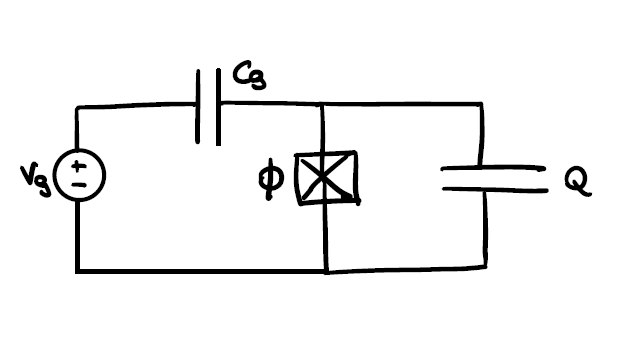

Il condensatore orizzontale che collega il generatore con la giunzione simboleggia l'accoppiamento capacitivo del qubit a una sorgente di tensione arbitraria.
Il qubit di carica è costituito semplicemente da una giunzione Josephson in parallelo ad un condensatore. La differenza fondamentale rispetto a un normale circuito LC è il **comportamento non lineare** della giunzione. La caratteristica sinusoidale della sua corrente dà origine a un profilo anarmonico del potenziale:

$$
\begin{aligned}
\hat{H} = 4E_c \hat{n}^2 - E_j cos(\phi)
\end{aligned}
$$

dove $\hat{n}$ è l'**operatore numero** che è direttamente collegato agli operatori di creazione e annichilazione e rappresenta il numero di coppie di Cooper all'interno del circuito, $E_c$ è l'**energia di carica** con una proporzionalità inversa rispetto alla capacità del condensatore e $E_j$ è l'**energia Josephson** mentre $\phi$ è la differenza di fase della funzione d'onda macroscopica attraverso la giunzione.

Il comportamento quadratico dell'energia risiede ora interamente nell'operatore numero, mentre il potenziale non lineare della giunzione dà luogo a salti anarmonici all'interno del suo profilo.

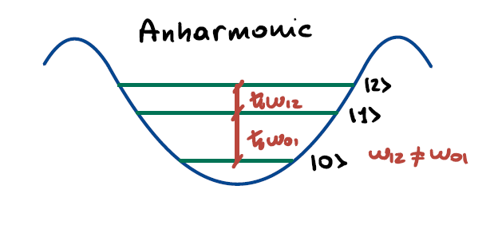

Grazie all'anarmonicità del potenziale, le transizioni energetiche discrete accessibili in chiave quantistica sono ora disomogenee e consentono di controllare due stati in modo indipendente.

### Regime transmonico

Storicamente, le prime implementazioni del qubit a superconduttore erano qubit di carica, in cui l'informazione era codificata nella quantità di coppie di Cooper all'interno del circuito. 
La principale fonte di rumore che degrada tali sistemi è il **rumore di carica**, dovuto alle cariche in prossimità del circuito spinte dal generatore di tensione che il qubit percepisce, modellabile come una fluttuazione parametrica ($n_g$) del numero di portatori nell'Hamiltoniana:
$$
\begin{aligned}
\hat{H} = 4E_c (\hat{n}^2-n_g^2) - E_j cos(\phi)
\end{aligned}
$$
la fluttuazione potrebbe anche cambiare nel tempo.
La principale conseguenza del rumore di carica è la costante variazione delle frequenze di transizione del sistema rendendo quasi impossibile il controllo del qubit.

Per attenuare l'influenza di questo tipo di rumore, il contributo dell'energia Josephson nell'Hamiltoniana deve superare quello dell'energia di carica. L'implementazione di un dispositivo di interferenza quantistica a superconduttore (SQUID) per controllare $E_j$ o l'aumentare dell'area del condensatore per ridurre $E_c$ sono valide alternative per manipolare il rapporto $E_j/E_c$.

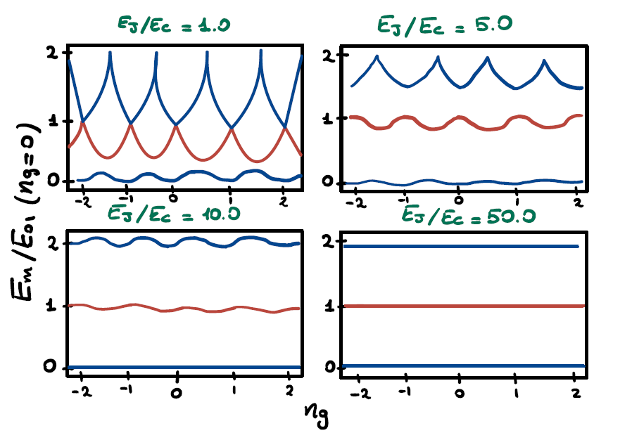

L'immagine sovrastante mostra il rapporto tra i livelli energetici con l'energia dello stato fondamentale in funzione della carica di rumore. È evidente che con bassi valori di $E_j/E_c$ piccole variazioni di $n_g$ portano a cambiamenti deleteri nelle transizioni energetiche.
Quando $E_j/E_c$ è nell'intervallo $20-80$ si dice che il qubit è in **regime transmonico** e la sensibilità alle fluttuazioni di carica è quasi completamente soppressa. Si noti anche che l'anarmonicità nelle transizioni si riduce con valori più alti di $E_j/E_c$, ma decade più lentamente dell'influenza della fluttuazione di carica, cosicché il qubit è ancora considerabile come un oscillatore quantistico anarmonico.

Essendo in regime transmonico, trascurando quindi il termine di carica di rumore nell'Hamiltoniana ed esprimendo l'energia con gli operatori di creazione e annichilazione, si trova questa forma finale:

$hat{H} = \hbar w_q \hat{b} ^ \dagger \hat{b} - E_c/\hat{b}^ \dagger \hat{b} ^\dagger \hat{b}\hat{b}$

dove $\hbar w_q = \sqrt{8 E_c E_j} - E_c$ è la **frequenza corretta del trasmone** e si riferisce alla prima transizione di energia nello spettro.

# Implementazione tecnologica

## Il modello Jaynes - Cummings

Ora che abbiamo costruito il nostro atomo, ci sono alcuni problemi importanti da risolvere: **come** possiamo **controllare lo stato quantistico** senza perturbarlo? Come misurarlo invece? Prima di parlarne, dobbiamo fare un passo indietro, utilizzando un parallelismo per capire meglio il nostro sistema fisico. 

Sappiamo che, se trasmettiamo un raggio laser verso un atomo alla giusta frequenza, possiamo eccitare il suo stato, promuovendo l'elettrone orbitante a un livello energetico superiore.  
Questo modello è descritto dall' hamiltoniana di **Jaynes - Cummings**:

$$
\begin{aligned}
 \hat H_{JC} = \omega_r \hat a^\dagger \hat a + \frac{\omega_{01}}{2} \hat\sigma_z + g (\hat a^\dagger \hat\sigma_- + \hat a \hat\sigma_+) 
\end{aligned}
$$

L'interazione luce-materia è ben descritta nel terzo elemento:
+ la diseccitazione dell'atomo porta alla creazione di un fotone
+ “sacrificare” un fotone significa eccitare l'atomo

Questo controllo a livello atomico può essere ben eseguito all'interno di un risonatore ottico.
Un risonatore è una struttura in grado di selezionare determinate frequenze d'onda per risuonare in un sistema. Prendiamo ad esempio una chitarra: le sue corde emettono determinate note perché ne selezioniamo una certa lunghezza, premendo le corde sulla sua superficie.

Un esempio noto in fisica è la **cavità di Fabry-Perot**, utilizzata per la costruzione dei laser: se mettiamo due specchi uno di fronte all'altro a una certa distanza, solo poche frequenze di onde elettromagnetiche oscilleranno tra loro. Mettere **un atomo** all'interno della cavità di Febry - Perot ci permette di controllarne lo stato energetico.

Facciamo lo stesso per il nostro qubit transmon: se lo poniamo all'interno di un **risonatore** fatto di **linee di trasmissione superconduttrici**, potremo controllarlo e misurarlo.

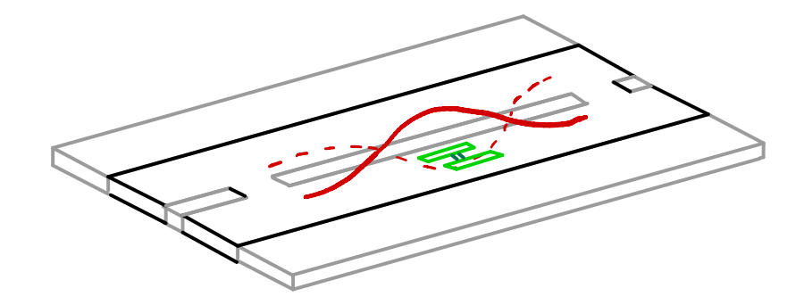

Per dimostrare ciò, esaminiamo il circuito equivalente di questo sistema, per ricavarne l'hamiltoniana. La tecnica di studiare i sistemi quantistici analizzando il loro circuito equivalente è chiamata **elettrodinamica quantistica dei circuiti** (**QED**).

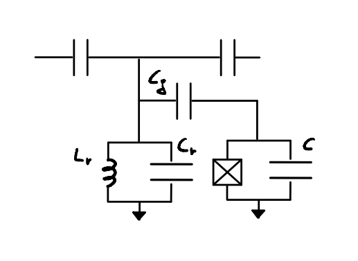

La derivazione di questo circuito è semplice: 
+ il risonatore è rappresentato da un oscillatore armonico (circuito LC)
+ il qubit è rappresentato da un oscillatore anarmonico (circuito JJ + C)
+ L'accoppiamento tra i due è rappresentato da una capacità ($C_g$).

L'hamiltoniana corrispondente a questo circuito è: 
$$
\begin{aligned}
 \hat H = (\frac{\hat Q^2_r}{2C_r} +\frac{\hat \Phi ^2_r}{
 2 L_r}) + (4 E_c \hat n^2 - E_j cos \hat \phi)
\end{aligned}
$$

 che, con alcune approssimazioni, è **equivalente** al modello di Jayes - Cummings.

Quindi, *possiamo controllare l'informazione immagazzinata in un qubit con onde elettromagnetiche così come possiamo controllare lo stato energetico di un atomo con un laser*!

## Il regime dispersivo

Ora che il nostro modello è pronto per essere utilizzato, c'è un problema importante da risolvere: **come** possiamo **modificare lo stato del qubit** senza perturbarlo?

Sappiamo dai concetti di base della fisica quantistica che entrare in contatto con un sistema quantistico porta al suo collasso: pertanto dobbiamo trovare un modo per modificare l'informazione quantistica e creare un computer utile.

La soluzione si ottiene nel **regime dispersivo**: l'idea principale è quella di utilizzare due frequenze diverse, una per il controllo ($\omega_{01}$) e una per la lettura ($\omega_r$), in modo da effettuare due operazioni distinte sul qubit.

Se scegliamo queste due frequenze in modo tale che:
$$
\begin{aligned}
\Delta = | \omega_{q}-\omega_r| >> g
\end{aligned}
$$

l'hamiltoniana di Jaynes - Cummings può essere approssimata a:

$$
\begin{aligned}
\hat H_{disp} = (\omega_r + \chi \hat \sigma _z) \hat a^\dagger \hat a + \frac{\omega_{q}}{2}\hat \sigma_z
\end{aligned}
$$
con $\chi \approx \frac{g^2}{\Delta} $.

Ciò ha due conseguenze dirette:
+ se **l'autovalore** di $\sigma_z$ è **+1** (il qubit è in uno stato eccitato), la frequenza di risonanza del risonatore diventerà $\omega_r + \chi$

+ Se **l'autovalore** di $\sigma_z$ è **-1** (il qubit è nel ground state), la frequenza di risonanza del risonatore diventerà $\omega_r - \chi$.

Ciò significa che lo stato del qubit influenza il sistema che lo circonda.

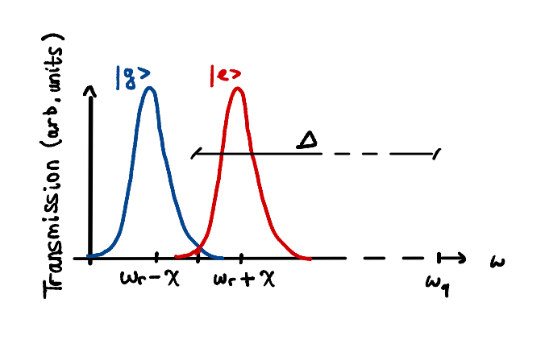

Come si può notare da questa immagine, $\omega_q$ e $\omega_r$ sono molto distanti l'uno dall'altro.

È ora di usare questo sistema!

+ **misura**: sondare il risonatore alla frequenza di $\omega_r$; a seconda dello stato del qubit, la frequenza di trasmissione sarà a $\omega_r + \chi$ o $\omega_r - \chi$.

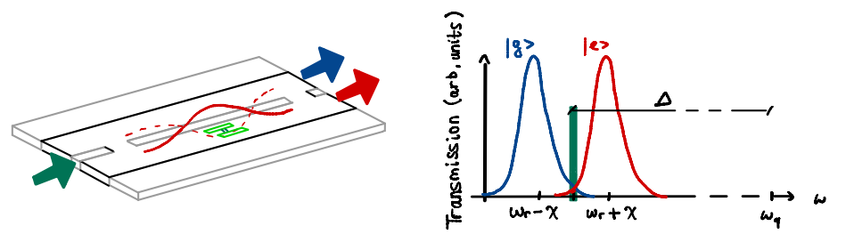

+ **controllo**: sondare il risonatore a $\omega_q$ con la forma d'onda necessaria per ruotare lo stato del qubit

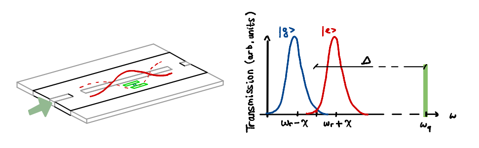

## Controllo del qubit

Ma cosa intendiamo esattamente con “**rotazione dello stato del qubit**”? Come è possibile farlo con frequenze di risonanza?

Prima di parlarne, dobbiamo fare un breve riepilogo su un argomento importante nell'analisi dei segnali: la **modulazione I/Q**.

Un segnale (una forma d'onda generica, come una sinusoide) può essere scomposto in due componenti additive:
+ un segnale **in fase (I)**, che avrà fase zero
+ un segnale **in quadratura (Q)**, con fase pari a $\frac{\pi}{2}$.

Un segnale a frequenza fissa può anche essere rappresentato come un punto in un piano complesso, i cui assi indicano le componenti I e Q che lo costituiscono:

Utilizzando nuovamente la tecnica QED, si ricava l'hamiltoniana della **tensione di pilotaggio** e del sistema di qubit controllati:

$$
\begin{aligned}
\hat H_d = \Omega V_0 s(t) (I \sigma_x + Q \sigma_y)
\end{aligned}
$$

dove: 
+ $\Omega = \frac{C_d}{C_\Sigma} Q_0$ (costante relativa al circuito equivalente)
+ $V_0$ è l'ampiezza della tensione generata
+ $s(t)$ è la forma d'onda del segnale

L'idea principale è quella di *modulare le componenti I e Q del segnale di pilotaggio per selezionare una rotazione lungo l'asse x o y del qubit*.

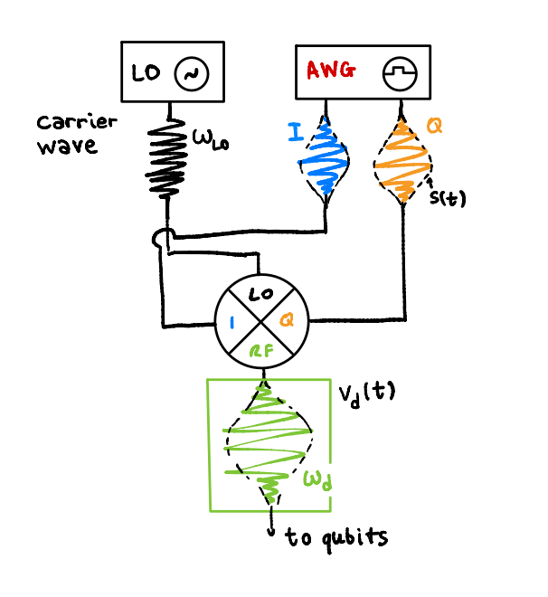

Quindi, si hanno due casi:

+ se **Q = 0**, si ottiene la **rotazione intorno all'asse x**
+ se **I = 0**, si ottiene la **rotazione intorno all'asse y**

Il caso della **rotazione attorno all'asse z** è diverso; infatti, il gate z è detto "virtuale", poiché non possiamo eseguire direttamente una rotazione attorno all'asse z, ma solo **regolare la fase del segnale** per trasformare le sue componenti I e Q:

$I' = I \cos \phi - Q \sin \phi $

$Q' = I \sin \phi - Q \cos \phi $

In tutti e tre i casi, l'angolo di rotazione è legato alla durata del segnale di pilotaggio.

# That's all, folks!

Con questo articolo vi abbiamo spiegato:
+ cos'è la **superconduttività**;
+ cos'è un **qubit transmon**;
+ come **manipolare il qubit** in un computer quantistico superconduttivo.

Se questo articolo vi è piaciuto, condividetelo con i vostri amici quantistici! O anche con il vostro cane, il vostro gatto, il vostro cavallo...

