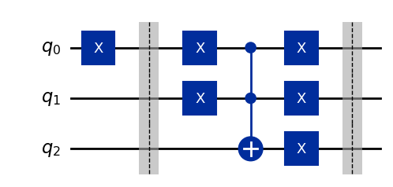

# Introduction to Qiskit

This is the first article in a series about Qiskit and will start from the very basics. Despite there are many similar videos and articles online, the goal of this lecture is to give new students a first hands-on approach to the topic with - hopefully - a good balance between details and ease for a beginner. After this lecture you should be able to start creating and simulating circuits in Qiskit.

## Preliminary concepts

In case you are not familiar with quantum circuits and gates, I suggest you have a look at [IBM Quantum Composer](https://quantum.ibm.com/composer/files/new), [Quirk quantum circuit simulator](https://algassert.com/quirk) and [Bloch sphere simulator](https://bloch.kherb.io/). These tools are a great way to familiarize with the quantum world using a graphical interface.

## First steps with Qiskit

Before writing code on our own, we can try running the code that in the composer to confirm that what we were seeing was actual Qiskit code. Look in the right panel of the composer and you should see some python code similarly to the following image (you may need to select "Qiskit" from the drop down menu if "OpenQASM 2.0" is already selected).


If you don't what do open the composer just for this test, you can try running this code

```py
from qiskit import QuantumRegister, ClassicalRegister, QuantumCircuit
from numpy import pi

qreg_q = QuantumRegister(2, 'q')
creg_c = ClassicalRegister(2, 'c')
circuit = QuantumCircuit(qreg_q, creg_c)

circuit.h(qreg_q[0])
circuit.cx(qreg_q[0], qreg_q[1])
circuit.measure(qreg_q[0], creg_c[0])
circuit.measure(qreg_q[1], creg_c[1])
```

If everything worked, Jupyter should output something similar to this:

```
<qiskit.circuit.instructionset.InstructionSet at 0x7f84d02584c0>
```

This is a first step, but we would like to see something a bit nicer, like the drawing of the circuit!

Before seeing how to draw circuits, let's briefly analyze the code above:

The first two lines with the `from ... import ...` are used to import python libraries which contain the functions and classes needed in the following. You don't have to worry too much about the details for now, just remember to include what's needed before running the code.

After this we start with the creation of the circuit itself, as a first step we create one quantum and one classical **register**. Registers are *collections* of bits or qubits, if you don't have experience with classical computers you can see them as a way to group (q)bits that have a similar meaning. To give an example, if you are trying to create a circuit that sums two 3-digit numbers `A` and `B`, you could create a register `regA` with three bits to store the digits of `A` and do the same for `B`; in this way it is easier to remember what is what. Although registers are useful when creating complex circuits, they can create confusion with very simple circuits as the one in this article; for this reason I will not use them much later. I will only show them in this example since they are used by default in the composer. 

The important thing to remember is that a `QuantumRegister` is an array of qubits, so writing `qreg_q[0]` means "taking the first qubit in quantum register `qreg_q`".

Now we can proceed creating a quantum circuit named `circuit` that contains 2 qubits (the ones in `qreg_q`) and 2 bits (the ones from `creg_c`). 

If we want to start adding gates and operations to the circuit we can use the syntax shown in the following lines. In this example we apply a Hadamard gate (`h`) to the first qubit and then a CNOT gate (`cx`) that is *controlled* by the first qubit and has as a *target* the second qubit.

Finally we `measure` the two qubits saving the results in the respective classical bits.

### Drawing a circuit

Now that we have an idea of what the code above does, we want to see what it looks like in reality. This is very simple to do: just add the following line to the code and run it again.

```py
circuit.draw(output="mpl") # Possible output formats: None, mpl, latex
```

You should see an image like this one, which is exactly what was shown in the composer!


Note that you may get an error if you don't have some required library. If you do, try installing the libraries specified in the output or try removing `output="mpl"`, the result will not be so fancy but it should work out of the box. If you have more doubts you can refer to the [documentation](https://docs.quantum.ibm.com/guides/visualize-circuits).


## How to deal with more complex circuits and gates

With what we saw before, you should be able to create basic circuits but it will soon become difficult to create advanced algorithms without introducing a couple more concepts. As an example, we would like to solve a simple problem:

*How can we create an OR gate in a quantum circuit?*

This question may seem silly at first: why should we care about creating a classical gate on a quantum circuit? For the time being it is not too important and it can be seen just as an exercise, but if you are curious you can look into oracles for the Grover algorithm; to implement them classical gates are extremely useful!

Another question that may arise is: why do we want to create the OR and not the AND? Well, because we already have the quantum version of the AND gate, it is called Toffoli gate or controlled-controlled-not (`ccx` in Qiskit).

This is what the Toffoli gate and its truth table look like:


First of all we notice that this gate operates on 3 qubits and not on 2 as we would expect, the reason for this is not simple, for completing the exercise you should just keep in mind that the Toffoli behaves exactly as an AND gate when in input we have $ C = |0\rangle $, the result of the AND will be found in $ C $ after the application of the gate.

You can verify this statement by seeing that if you ignore the rows where $ C = |1\rangle $, the truth table of the Toffoli becomes identical as the one of the AND.

The reason why the "quantum AND" needs 3 qubits is that all quantum gates must be **reversible**, which means that, given *any* output of the gate, it *must* be possible to *uniquely* identify the input that generated it. As an example, look at the truth table of the AND gate: if you tell me that the output of the AND is $ 0 $, I wouldn't be able to know if the input was `00`, `01` or `10`.

| A | B | A and B| A or B |
|---|---|--------|--------|
| 0 | 0 |    0   |   0    |
| 0 | 1 |    0   |   1    |
| 1 | 0 |    0   |   1    |
| 1 | 1 |    1   |   1    |

Let's go back to the original question of creating the OR gate, we saw that we already have the AND, but what do we do with this information? Before "invoking" theorems, let's do a couple of simple logical steps and see where we end up:

Let's try completing the following truth table where the inputs have been "flipped":

| not A | not B | (not A) and (not B)|not( (not A) and (not B) )|
|-------|-------|--------------------|-------------------------|
|   1   |   1   |        1           |        0                |
|   1   |   0   |        0           |        1                |
|   0   |   1   |        0           |        1                |
|   0   |   0   |        0           |        1                |

This seems an arbitrary choice of operations but if we look at the last column we can easily see that this is the same as the "OR" column of the first table, meaning that we created the "OR" function using only ANDs and NOTs! We could also do this formally using the [De Morgan's law](https://en.wikipedia.org/wiki/De_Morgan%27s_laws).

Now we have all the ingredients to move on and create our first custom gate! But first let's recap the steps:

We want to create the OR gate using Qiskit by starting with the AND (Toffoli) gate and the NOT (X) gate. In Qiskit we already have these gates in the form of the `ccx` and `x` gates. Using the De Morgan's law (or the simple steps above), we have proved that the following equivalence 

`
A | B = !(!A & !B)
`

or, if you prefer a different notation

$$
A \lor B \equiv \lnot (\lnot A \land \lnot B)
$$

Let's now see how to convert this formula into a quantum circuit: first of all let's point out that quantum circuits and gates, in Qiskit, can be used interchangeably, this means that we can create a quantum circuit as we did before and, later, use it as a single gate. We will see later how to do this, for the moment let's focus on creating a circuit that implements the OR gate, using the formula above.

To begin with, we need a circuit with three qubits, `A` and `B` which are the inputs and `C` which will contain the output.

```py
qc = QuantumCircuit(3)
```

Notice how, in this case, I did not use any register but simply specified the number of qubits in the parameters of `QuantumCircuit`, let's keep in mind that the first qubit (i.e. `qc[0]`) represents `A`, the second represents `B` and the third `C`.

Now it's just a matter of seeing which gate is applied to which qubit, in the formula we see that we have `x` gates applied to both `A` and `B`, so we can add them in python as follows:

```py
qc.x(0)
qc.x(1)
```

Then we have the AND between `A` and `B`; remember, the Toffoli (`ccx`) gate behaves as an AND when `C` (the target) is initially set to $|0\rangle$, so we can add this gate as follows:

```py
qc.ccx(0, 1, 2)
```

Finally we have to negate the output (the first NOT in the formula), since `C` is the output, we simply need to add an `x` gate to the third qubit:

```py
qc.x(2)
```

It seems like we are done, let's see what the resulting circuit looks like at this point:


This circuit gives the correct results **but has an important problem**: it changes the values of its inputs! Look at the first 2 qubits, they are subject to an `x` gate and so their value at the beginning is different from the one at the end. This is something we don't want as it stops us from using the original `A` and `B` again.

Luckily solving the issue is very simple, we just need to apply the inverse operation of the `x` gate which is... the `x` gate itself! (Negating a given quantity twice is the same as doing nothing or, more formally $X \cdot X = \mathbb{I}$)

So let's fix this problem:

```py
qc.x(0)
qc.x(1)
```

The final circuit for the OR is then:


To make the code we wrote easier to use in the following (and to create a real gate), let's put everything inside a function that returns the circuit itself:

```py
def OR() -> QuantumCircuit:
    qc = QuantumCircuit(3)
    qc.barrier()
    qc.x(0)
    qc.x(1)
    qc.ccx(0, 1, 2)
    qc.x(0)
    qc.x(1)
    qc.x(2)
    qc.barrier()
    return qc
```

In this way, when we will need to use the OR gate in Qiskit, we will simply have to call this function.

Notice that I also added two `barrier`s at the beginning and end of the gate, barriers are not gates but are simply "vertical lines" that make it easier to visually delimit things when drawing the circuit (see the drawing above).

If you are wondering about the `-> QuantumCircuit` in the first line, it specifies the type of the object which will be returned by the function, it is not mandatory (as a matter of fact if you don't put it nothing will change when running the code) but it allows your IDE (e.g. VSCode) to give you helpful autocompletion. 

## Composing circuits

If we want to use this new gate we created inside a bigger circuit, we cannot simply write `circuit.OR` because this is not a "native" Qiskit gate, what we have to do is "attach" (i.e. compose) it to an existing circuit. Let's see how:

```py
qc = QuantumCircuit(3)
qc.x(0)
qc.compose(OR(), [0,1,2], inplace=True)
qc.draw()
```

In the few lines above we created a quantum circuit with 3 qubits, applied an `x` gate to the first (just as an example) and then attached our OR gate with the `compose` function. This function needs the following parameters, the first one is the circuit we want to attach (the OR in this case), then a list of the order in which to attach the qubits (i.e. "connect the cables"), most of the times we want to connect the first qubit of the circuit to the first input of the gate, the second to the second and so on... The final parameter `inplace` should always be set to `True`, otherwise the original circuit will not be modified.

Drawing the circuit gives us:



### Bonus tip

When working with complex circuits, things can become cluttered really fast, to hide the complexity of a circuit in the drawing, we can use the `to_instruction` method, which will draw our sub-circuit as a simple box:

```py
box_OR = OR().to_instruction(label='OR')

qc = QuantumCircuit(3)
qc.x(0)
qc.compose(box_OR, [0,1,2], inplace=True)
qc.draw('mpl')
```


If, on the other hand, you want to inspect how the OR circuit is built after converting it to and instruction, you can `decompose` it as follows:

```py
box_OR = OR().to_instruction(label='OR')

qc = QuantumCircuit(3)
qc.x(0)
qc.compose(box_OR, [0,1,2], inplace=True)
qc.decompose().draw('mpl')
```


Notice also how, `decompose` reveals that the `x` gate is, in reality, implemented as an `U3` gate.

## Simulating a quantum circuit

Now we are quite good at creating circuits, but so far we haven't run anything, let's fix this by seeing one of the many possible ways of simulating circuits in Qiskit. The process reported here simulates a circuit **ideally**, i.e. without any source of noise, decoherence and so on. If you want to go into more details you should check the documentation:

+ <https://qiskit.github.io/qiskit-aer/tutorials/1_aersimulator.html>
+ <https://docs.quantum.ibm.com/guides/simulate-with-qiskit-aer>

Before proceeding, let's import the necessary libraries (in addition to the ones we already imported):

```py
from qiskit import transpile
from qiskit_aer import AerSimulator

from qiskit.visualization import plot_histogram, plot_state_city
```

When we want to run a simulation, we also need some classical bits to "save" the results of the measurements, so let's add them to the circuit we want to simulate. We can do this in two ways, either manually (specifying the classical bits when creating the circuit and then using them when calling `measure_all`), or letting the `measure_all` function add them for us, here I report both solution but, most of the times, the second one is more convenient.
 
```py
qc = QuantumCircuit(3, 3)
qc.compose(OR(), inplace=True)
qc.measure_all(add_bits=False)
qc.draw('mpl')
```


```py
qc = QuantumCircuit(3)
qc.compose(OR(), inplace=True)
qc.measure_all()
qc.draw('mpl')
```


Now we are ready to run the simulation, since this is quite a complex topic to be treated in detail, I will give just a basic "recipe" that can be used in simple cases, for more advanced simulations or to understand the various steps, refer to the links above.

```py
sim = AerSimulator()
transpiled_qc = transpile(qc, sim)
result = sim.run(transpiled_qc).result()
counts = result.get_counts(transpiled_qc)

plot_histogram(counts)
```

What this gives us is an histogram like the following one:


Since this circuit is simply an OR gate, with the two inputs set to `0`, we get the expected result of having all the qubits (the two inputs and the output) set to `0` since `0 | 0 = 0`.

Try messing around with the circuit (for example adding `x` gates to the inputs) to see if the simulation matches you expectations.

## Final exercise

To test what you learnt, try implementing on your own a [half adder](https://www.geeksforgeeks.org/half-adder-in-digital-logic/). It may look complex at first, but in the end, you will only have to join together the pieces you already have with functions you already know.

If you need some help, I'll provide you with the XOR gate which you may need:

```py
## XOR circuit
def XOR() -> QuantumCircuit:
    qc = QuantumCircuit(3)
    qc.cx(0, 2)
    qc.cx(1, 2)
    return qc
```