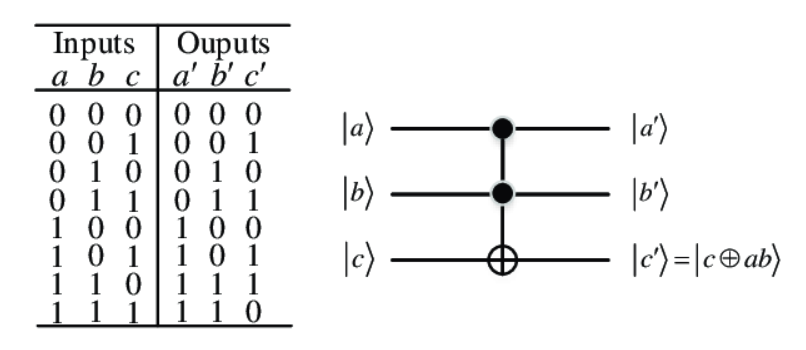
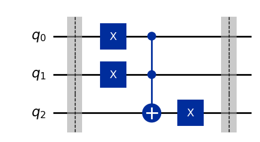
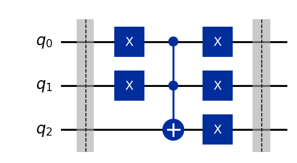
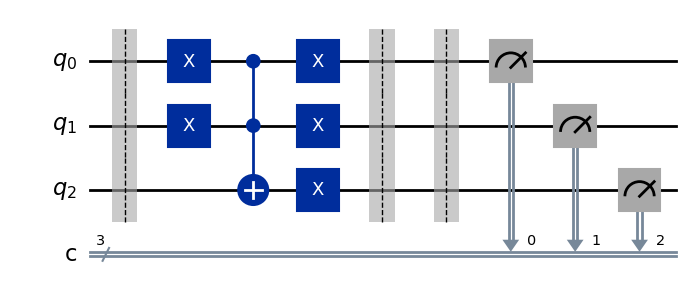
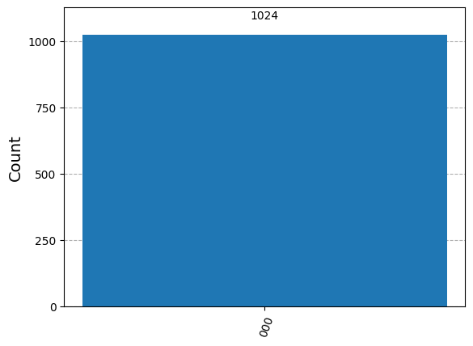

<!-- # Introduzione a Qiskit -->

Questo è il primo articolo di una serie su Qiskit e partirà dalle basi. Nonostante ci siano molti video e articoli simili online, l'obiettivo di questa lezione è fornire ai nuovi studenti un primo approccio pratico all'argomento con - si spera - un buon equilibrio tra dettagli e facilità per un principiante. Dopo questa lezione dovresti essere in grado di iniziare a creare e simulare circuiti in Qiskit.

## Concetti preliminari

Nel caso tu non sia familiare con i circuiti quantistici e le porte, ti consiglio di dare un'occhiata a [IBM Quantum Composer](https://quantum.ibm.com/composer/files/new), [Quirk quantum circuit simulator](https://algassert.com/quirk) e [Bloch sphere simulator](https://bloch.kherb.io/). Questi strumenti sono un ottimo modo per familiarizzare con il mondo quantistico utilizzando un'interfaccia grafica.

## Primi passi con Qiskit

Prima di scrivere codice da soli, possiamo provare a eseguire il codice presente nel composer per confermare che ciò che stavamo vedendo fosse effettivamente codice Qiskit. Guarda nel pannello di destra del composer e dovresti vedere del codice Python simile all'immagine seguente (potresti dover selezionare "Qiskit" dal menu a discesa se "OpenQASM 2.0" è già selezionato).


Se non vuoi aprire il composer solamente per questo step, puoi copiare il codice qui sotto

```py
from qiskit import QuantumRegister, ClassicalRegister, QuantumCircuit
from numpy import pi

qreg_q = QuantumRegister(2, 'q')
creg_c = ClassicalRegister(2, 'c')
circuit = QuantumCircuit(qreg_q, creg_c)

circuit.h(qreg_q[0])
circuit.cx(qreg_q[0], qreg_q[1])
circuit.measure(qreg_q[0], creg_c[0])
circuit.measure(qreg_q[1], creg_c[1])
```

Se tutto ha funzionato correttamente, Jupyter dovrebbe dare il seguente output:

```
<qiskit.circuit.instructionset.InstructionSet at 0x7f84d02584c0>
```

Questo è un primo passo, ma ci piacerebbe vedere qualcosa di un po' più rappresentativo, come il disegno del circuito!

Prima di vedere come disegnare i circuiti, analizziamo brevemente il codice sopra:

Le prime due righe con `from ... import ...` servono per importare librerie Python che contengono le funzioni e le classi necessarie in seguito. Non preoccuparti troppo dei dettagli per ora, ricorda solo di includere ciò che è necessario prima di eseguire il codice.

A questo punto possiamo iniziare con la creazione del circuito stesso; come primo passo creiamo un **registro** quantistico e uno classico. I registri sono *collezioni* di bit o qubit; se non hai esperienza con i computer classici, puoi vederli come un modo per raggruppare (q)bit che hanno un significato simile. Per fare un esempio, se stai cercando di creare un circuito che somma due numeri a 3 cifre `A` e `B`, potresti creare un registro `regA` con tre bit per memorizzare le cifre di `A` e fare lo stesso per `B`; in questo modo è più facile ricordare il significato di ciascun bit. Sebbene i registri siano utili quando si creano circuiti complessi, possono creare confusione con circuiti molto semplici come quelli in questo articolo; per questo motivo non li utilizzerò molto in seguito.

La cosa importante da ricordare è che un `QuantumRegister` è un array di qubit, quindi scrivere `qreg_q[0]` significa "prendere il primo qubit nel registro quantistico `qreg_q`".

Ora possiamo procedere creando un circuito quantistico chiamato `circuit` che contiene 2 qubit (quelli in `qreg_q`) e 2 bit (quelli in `creg_c`).

Se vogliamo iniziare ad aggiungere porte e operazioni al circuito, possiamo utilizzare la sintassi mostrata nelle righe seguenti. In questo esempio applichiamo una porta Hadamard (`h`) al primo qubit e poi una porta CNOT (`cx`) che è *controllata* dal primo qubit e ha come *target* il secondo qubit.

Infine, *misuriamo* (`measure`) i due qubit salvando i risultati nei rispettivi bit classici.

### Disegnare un circuito

Ora che abbiamo un'idea di cosa fa il codice sopra, vogliamo vedere come appare nella realtà. È molto semplice: basta aggiungere la seguente riga al codice e rieseguirlo.

```py
circuit.draw(output="mpl") # Possibili formati di output: None, mpl, latex
```

Dovresti vedere un'immagine come la seguente, che corrisponde esattamente a quello che vedevamo nel composer!


Nota che potresti ricevere un errore se non hai alcune librerie richieste. Se ciò accade, prova a installare le librerie specificate nell'output oppure prova a rimuovere `output="mpl"`; il risultato non sarà così elegante, ma dovrebbe funzionare senza problemi. Se hai ulteriori dubbi, puoi fare riferimento alla [documentazione](https://docs.quantum.ibm.com/guides/visualize-circuits).


## Come trattare circuiti e gate più complessi

Con quanto abbiamo visto prima, dovresti essere in grado di creare circuiti di base, ma presto diventerà difficile creare algoritmi avanzati senza introdurre un paio di concetti in più. Come esempio, ci piacerebbe risolvere un problema semplice:

*Come possiamo creare una porta OR in un circuito quantistico?*

Questa domanda potrebbe sembrare sciocca all'inizio: perché dovremmo preoccuparci di creare una porta classica in un circuito quantistico? Per il momento non è troppo importante e può essere vista semplicemente come un esercizio, ma se vuoi approfondire puoi studiare gli oracoli per l'algoritmo di Grover; per implementarli, le porte classiche sono estremamente utili!

Un'altra domanda che potrebbe sorgere è: perché vogliamo creare la porta OR e non la AND? Semplicemente perché abbiamo già la versione quantistica della porta AND! jsi chiama porta Toffoli o controlled-controlled-not (`ccx` in Qiskit).

Ecco com'è fatta la porta Toffoli con la sua tabella della verità:



Prima di tutto, notiamo che questa porta opera su 3 qubit e non su 2 come ci aspetteremmo; il motivo non è immediato. Per completare l'esercizio ti serve solo sapere che la porta Toffoli si comporta esattamente come una porta AND quando in input abbiamo $ C = |0\rangle $; il risultato dell'AND sarà in $ C $ dopo l'applicazione della porta.

Puoi verificare questa affermazione osservando che, se ignori le righe in cui $ C = |1\rangle $, la tabella della verità della Toffoli diventa identica a quella dell'AND.

La ragione per cui il "quantum AND" richiede 3 qubit è che tutte le porte quantistiche devono essere **reversibili**, il che significa che, dato *qualsiasi* output della porta, deve essere possibile identificare in modo *univoco* l'input che l'ha generato. Ad esempio, guarda la tabella della verità della porta AND: se mi dici che l'output dell'AND è $ 0 $, non sarei in grado di sapere se l'input era `00`, `01` o `10`.

| A | B | A and B| A or B |
|---|---|--------|--------|
| 0 | 0 |    0   |   0    |
| 0 | 1 |    0   |   1    |
| 1 | 0 |    0   |   1    |
| 1 | 1 |    1   |   1    |

Torniamo alla domanda originale di creare la porta OR; abbiamo visto che abbiamo già l'AND, ma cosa ce ne facciamo? Prima di "invocare" teoremi, facciamo un paio di semplici passaggi logici e vediamo dove arriviamo:

Proviamo a completare la seguente tabella della verità in cui gli input sono stati "invertiti" rispetto alla precedente:

| not A | not B | (not A) and (not B)|not( (not A) and (not B) )|
|-------|-------|--------------------|-------------------------|
|   1   |   1   |        1           |        0                |
|   1   |   0   |        0           |        1                |
|   0   |   1   |        0           |        1                |
|   0   |   0   |        0           |        1                |

Questa sembra una serie di operazioni arbitrarie, ma, se guardiamo l'ultima colonna, possiamo facilmente vedere che coincide con la colonna "OR" della prima tabella, il che significa che abbiamo creato la funzione "OR" utilizzando solo AND e NOT! Potremmo anche farlo formalmente usando la [legge di De Morgan](https://it.wikipedia.org/wiki/Leggi_di_De_Morgan).

Ora abbiamo tutti gli ingredienti per procedere e creare la nostra prima porta personalizzata! Ma prima facciamo un riepilogo dei passaggi:

Vogliamo creare la porta OR su Qiskit partendo dalla porta AND (Toffoli) e dalla porta NOT (X). In Qiskit abbiamo già queste porte nella forma delle porte `ccx` e `x`. Utilizzando la legge di De Morgan (o i semplici passaggi sopra), abbiamo dimostrato la seguente equivalenza:

```
A | B = !(!A & !B)
```

oppure, se preferisci una notazione diversa:

$$
A \lor B \equiv \lnot (\lnot A \land \lnot B)
$$

Vediamo ora come convertire questa formula in un circuito quantistico: prima di tutto, sottolineiamo che i circuiti e le porte quantistiche, in Qiskit, possono essere utilizzati in modo intercambiabile. Ciò significa che possiamo creare un circuito quantistico come abbiamo fatto in precedenza e, successivamente, utilizzarlo come una singola porta. Vedremo più avanti come fare tutti i passaggi; per il momento concentriamoci sulla creazione di un circuito che implementi la porta OR, utilizzando la formula sopra.

Per cominciare, abbiamo bisogno di un circuito con tre qubit: `A` e `B`, che sono gli input, e `C`, che conterrà l'output.

```py
qc = QuantumCircuit(3)
```

Nota come, in questo caso, non ho utilizzato alcun registro ma ho semplicemente specificato il numero di qubit nei parametri di `QuantumCircuit`. Teniamo a mente che il primo qubit (cioè `qc[0]`) rappresenta `A`, il secondo rappresenta `B` e il terzo `C`.

Ora è solo una questione di vedere quale porta è applicata a quale qubit. Nella formula vediamo che abbiamo porte `x` (NOT) applicate sia a `A` che a `B`, quindi possiamo aggiungerle in Python come segue:

```py
qc.x(0)
qc.x(1)
```

Poi abbiamo una AND tra `A` e `B`; ricordati che la Toffoli (`ccx`) si comporta come una AND quando `C` (il target) è inizializzato a $ | 0 \rangle $, quindi possiamo aggiungerlo come segue:

```py
qc.ccx(0, 1, 2)
```

Infine, dobbiamo negare l'output (il primo NOT nella formula); poiché `C` è l'output, dobbiamo semplicemente aggiungere una porta `x` al terzo qubit:

```py
qc.x(2)
```

Sembrerebbe di aver finito, vediamo come appare il circuito risultante a questo punto:



Questo circuito fornisce i risultati corretti **ma ha un problema importante**: cambia i valori dei suoi input! Guarda i primi 2 qubit, sono soggetti a una porta `x` e quindi il loro valore all'inizio è diverso da quello alla fine. Questo comportamento presenta dei problemi poiché ci impedisce di riutilizzare i valori originali di `A` e `B`.

Fortunatamente, risolvere il problema è molto semplice; dobbiamo solo applicare l'operazione inversa della porta `x`, che è... 

la porta `x` stessa! (Negare una quantità  due volte è come non fare nulla o, più formalmente, $ X \cdot X = \mathbb{I} $)

Quindi, per risolvere il problema, basta aggiungere queste due righe:

```py
qc.x(0)
qc.x(1)
```

Il circuito finale per la OR è quindi:



Per rendere il codice che abbiamo scritto più facile da usare in seguito (e per creare una vera porta), mettiamo tutto all'interno di una funzione che restituisce il circuito stesso:

```py
def OR() -> QuantumCircuit:
    qc = QuantumCircuit(3)
    qc.barrier()
    qc.x(0)
    qc.x(1)
    qc.ccx(0, 1, 2)
    qc.x(0)
    qc.x(1)
    qc.x(2)
    qc.barrier()
    return qc
```

In questo modo, quando avremo bisogno di utilizzare la porta OR in Qiskit, dovremo semplicemente chiamare questa funzione.

Nota che ho anche aggiunto due `barrier` all'inizio e alla fine della porta; le barriere non sono porte, ma sono semplicemente "linee verticali" che rendono più facile delimitare visivamente le cose quando si disegna il circuito (vedi il disegno sopra).

Nota poi l'annotazione `-> QuantumCircuit` nella prima riga, questo è il modo in cui è possibile specificare il tipo dell'oggetto restituito dalla funzione in Python; non è obbligatorio aggiungerlo (infatti, se non lo metti, non cambierà nulla nell'esecuzione del codice), ma consente al tuo IDE (ad esempio, VSCode) di offrirti suggerimenti utili mentre scrivi il codice.

## Comporre circuiti

Se vogliamo utilizzare la nuova porta che abbiamo creato all'interno di un circuito più grande, non possiamo semplicemente scrivere `circuit.OR` perché questa non è una porta "nativa" di Qiskit. Quello che dobbiamo fare è "attaccarla" (cioè comporla) a un circuito esistente. Vediamo come:

```py
qc = QuantumCircuit(3)
qc.x(0)
qc.compose(OR(), [0,1,2], inplace=True)
qc.draw()
```

Nelle righe sopra, abbiamo creato un circuito quantistico con 3 qubit, applicato una porta `x` al primo (solo come esempio) e poi attaccato la nostra porta OR con la funzione `compose`. Questa funzione richiede i seguenti parametri: il primo è il circuito che vogliamo attaccare (l'OR in questo caso), poi una lista dell'ordine in cui attaccare i qubit (cioè come "collegare i cavi"). Nella maggior parte dei casi vogliamo collegare il primo qubit del circuito al primo input della porta, il secondo al secondo e così via... L'ultimo parametro `inplace` dovrebbe sempre essere impostato su `True`, altrimenti il circuito originale non verrà modificato.

Disegnando il circuito otteniamo:


### Bonus tip

Quando si lavora con circuiti complessi, è facile "perdersi" tra decine e decine di gate. Per ridurre la complessità del disegno, possiamo utilizzare il metodo `to_instruction`, che disegnerà il nostro sotto-circuito come una semplice scatola:

```py
box_OR = OR().to_instruction(label='OR')

qc = QuantumCircuit(3)
qc.x(0)
qc.compose(box_OR, [0,1,2], inplace=True)
qc.draw('mpl')
```


Se invece vogliamo ispezionare un circuito dopo averlo convertito in istruzioni, possiamo *decomporlo* così

```py
box_OR = OR().to_instruction(label='OR')

qc = QuantumCircuit(3)
qc.x(0)
qc.compose(box_OR, [0,1,2], inplace=True)
qc.decompose().draw('mpl')
```


Nota anche come, `decompose` ci mostra che la porta `x` in realtà viene implementata come una `U3`.

## Simulare un circuito quantistico

Ora siamo abbastanza bravi a creare circuiti, ma finora non ne abbiamo eseguito neanche uno. Vediamo come fare usando uno dei tanti modi possibili per simulare circuiti in Qiskit. Il metodo riportato qui esegue una simulazione **ideale**, cioè senza alcuna fonte di rumore, decoerenza e così via. Se desideri approfondire ulteriormente, puoi controllare la documentazione:

+ <https://qiskit.github.io/qiskit-aer/tutorials/1_aersimulator.html>
+ <https://docs.quantum.ibm.com/guides/simulate-with-qiskit-aer>

Prima di continuare, importa le librerie necessarie (in aggiunta a quelle importate all'inizio)

```py
from qiskit import transpile
from qiskit_aer import AerSimulator

from qiskit.visualization import plot_histogram, plot_state_city
```

Quando vogliamo eseguire una simulazione, abbiamo anche bisogno di alcuni bit classici per "salvare" i risultati delle misurazioni, quindi aggiungiamoli al circuito che vogliamo simulare. Possiamo farlo in due modi: manualmente (specificando i bit classici quando creiamo il circuito e poi utilizzandoli quando chiamiamo `measure_all`), oppure lasciando che la funzione `measure_all` li aggiunga per noi. Qui riporto entrambe le soluzioni, ma, nella maggior parte dei casi, la seconda strada è più conveniente.
 
```py
qc = QuantumCircuit(3, 3)
qc.compose(OR(), inplace=True)
qc.measure_all(add_bits=False)
qc.draw('mpl')
```



```py
qc = QuantumCircuit(3)
qc.compose(OR(), inplace=True)
qc.measure_all()
qc.draw('mpl')
```


Ora siamo pronti per eseguire la simulazione. Dato che questo è un argomento piuttosto complesso da trattare in dettaglio, la seguente è solo una "ricetta" di base che può essere utilizzata in casi semplici. Per simulazioni più avanzate o per comprendere i vari passaggi, fai riferimento ai link sopra.

```py
sim = AerSimulator()
transpiled_qc = transpile(qc, sim)
result = sim.run(transpiled_qc).result()
counts = result.get_counts(transpiled_qc)

plot_histogram(counts)
```

Ciò che otteniamo è un istogramma simile al seguente:



Poiché il circuito è semplicemente una porta OR con i due input impostati su `0`, vediamo che tutti i qubit (i due input e l'output) valgono su `0`, poiché \(0 | 0 = 0\).

Prova a sperimentare con il circuito (ad esempio, aggiungendo porte `x` agli input) per vedere se la simulazione corrisponde alle tue aspettative.

## Esercizio finale

Per testare ciò che hai imparato, prova a implementare da solo un [half adder](https://www.geeksforgeeks.org/half-adder-in-digital-logic/). Potrebbe sembrare complesso all'inizio, ma alla fine dovrai solo unire i pezzi che hai già con funzioni che già conosci.

Se hai bisogno di aiuto, qui sotto puoi trovare il codice per la porta XOR di cui potresti avere bisogno:

```py
## XOR circuit
def XOR() -> QuantumCircuit:
    qc = QuantumCircuit(3)
    qc.cx(0, 2)
    qc.cx(1, 2)
    return qc
```