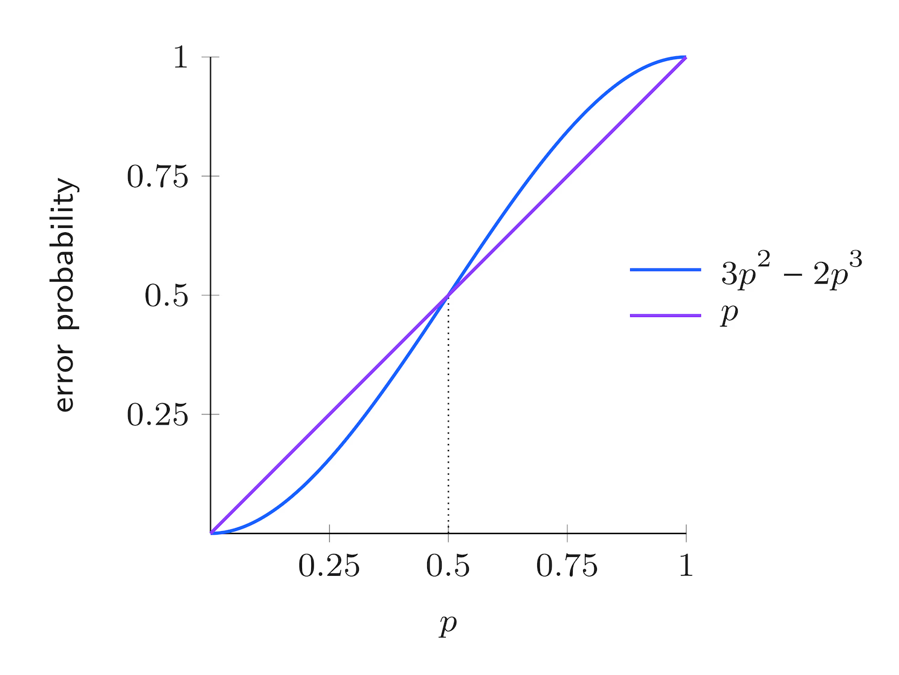
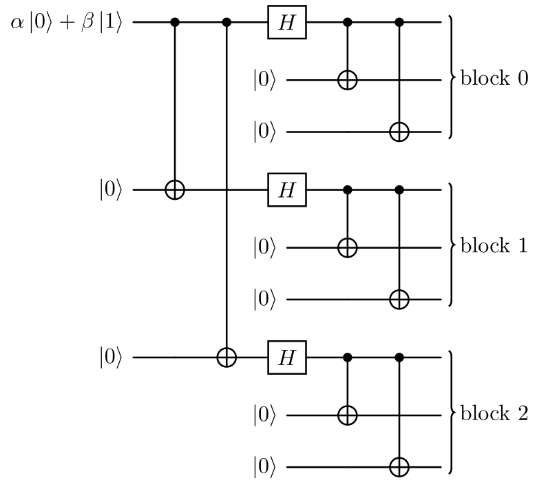
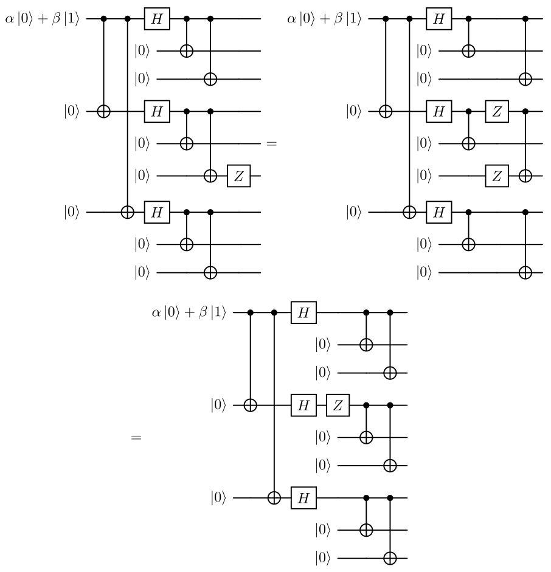
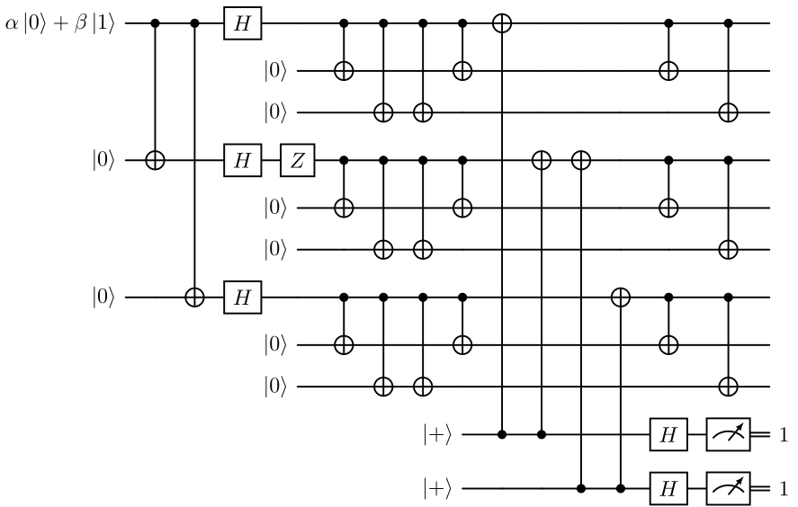

# Classical Repetition Codes

Noise is a fundamental challenge in information processing systems. Many classical systems are able to avoid noise completely, while others must make use of error-correcting codes to protect against the effects of noise. The key idea is redundancy: by encoding messages with extra information, errors can be detected and corrected even if part of the data is corrupted. Repetition codes are extremely basic examples of error correcting codes.

## Encoding and Decoding Procedures

The core idea is to protect a bit against errors by repeating it multiple times. Consider the 3-bit repetition code, where a single bit is encoded as three identical bits.

$$
\begin{aligned}
    0 &\mapsto 000 \cr
    1 &\mapsto 111 
\end{aligned}
$$
In the absence of errors, the original bit can be trivially decoded. However, even if one bit flips, the original value can still be recovered by majority voting: the decoder outputs whichever value appears more frequently.
$$
abc \mapsto majority(a,b,c)
$$
This corrects single-bit errors reliably.

Of course, if 2 or 3 bits of the encoding flip, then the decoding won’t work properly and the wrong bit will be recovered, but if at most 1 of the 3 bits flips, the decoding will be correct. This shows a central concept in error correction: the trade-off between redundancy and robustness.

## Error Analysis in Binary Symmetric Channels

As an example, suppose we wish to communicate a single bit to a hypothetical receiver through a classical noisy channel. The effect of the noise in the channel is to flip a transmitted bit with probability $p$, while with probability $1-p$ the bit is transmitted correctly. Such a channel is known as a *binary symmetric channel*, it flips each bit sent through it independently.

In this context, if we choose not to use any error correcting code and simply send whatever bit through the channel, the receiver will receive the wrong bit with probability $p$.

On the other hand, if we first use the 3-bit repetition code to encode the bit and then send each of the resulting three bits through the channel, each one of them will flip indipendently with probability $p$. The receiver will decode correctly only if at most one bit flips during the communication. So the probability of an error after the decoding corresponds to the probability that either two or each of the three bits flip during transmission. The total probability of an error is therefore
$$
3p^2(1-p)+p^3 = 3p^2-2p^3.
$$

This can be obtained using probability theory. Suppose we denote with
$$
p(X_1 \cap X_2 \cap X_3)
$$
the probability that when we obtain the 3-digit bit string, we obtain the result $X_i$ for the $i$-th bit, where the outcome can be $C_i$ for correct detection and $W_i$ for a wrong one.

Let’s consider the case where all three bits are wrong. Since the three events are independent (we assumed this at the beginning), the theory tells us that the probability of the intersection of the events is the product of the probabilities of the single events,
$$
p(W_1 \cap W_2 \cap W_3) = p(W_1) p(W_2) p(W_3) = p^3\.
$$
Analyzing the other case, we see that one possible scenario is the following:
$$
p(C_1 \cap W_2 \cap W_3) = p(C_1) p(W_2) p(W_3) = (1-p)p^2\.
$$
But this can also occur (with the same calculation):
$$
p(W_1 \cap C_2 \cap W_3) = (1-p)p^2\,
$$
and
$$
p(W_1 \cap W_2 \cap C_3) = (1-p)p^2\.
$$
The final expression for the event of only one correct bit is
$$
p\big((C_1 \cap W_2 \cap W_3) \cup (W_1 \cap C_2 \cap W_3) \cup (W_1 \cap W_2 \cap C_3)\big)\.
$$

Since the three composite events considered have an empty intersection (a bit cannot be simultaneously correct and wrong), the theory tells us that we can simply sum the single probabilities,
$$
\begin{aligned}
    p& \big((C_1 \cap W_2 \cap W_3) \cup (W_1 \cap C_2 \cap W_3) \cup (W_1 \cap W_2 \cap C_3)\big) = \cr
    &= p(C_1 \cap W_2 \cap W_3) + p(W_1 \cap C_2 \cap W_3) + p(W_1 \cap W_2 \cap C_3) = \cr
    &=3(1-p)p^2\.
\end{aligned}
$$

Finally, we have to consider the composite event of all errors or only one correct bit. Since those have an empty intersection, we end up with
$$
\begin{aligned}
    p&\Big( \big( (C_1 \cap W_2 \cap W_3) \cup (W_1 \cap C_2 \cap W_3) \cup (W_1 \cap W_2 \cap C_3)\big) \cup (W_1 \cap W_2 \cap W_3) \Big) = \cr 
    &= p^3 +3(1-p)p^2 =3p^2 -2p^3\.
\end{aligned}
$$

As can be seen in [above figure](#binary-symmetric-error), when the error probability $p$ is less than $1/2$, the repetition code effectively reduces the chance of the receiver obtaining an incorrect bit. Conversely, if $p$ exceeds $1/2$, the code amplifies the likelihood of decoding errors rather than correcting them. 
# Quantum Repetition Codes for Qubits

The 3-bit repetition code can be used also for qubit error correction.

## Encoding Quantum States

To create a 3-qubit repeated entangled state, we can use the circuit shown in the [figure below](#3-qubit-bit-flip-code-circuit-diagram). Thanks to this circuit we can encode the generic state $\alpha \ket{0}+ \beta \ket{1}$ into the state $\alpha \ket{000}+ \beta \ket{111}$, thanks to the action of the controlled NOT (CNOT) gates.

Notice that this encoding is different from the repetition of the same state three times $\ket{\psi}\otimes\ket{\psi}\otimes\ket{\psi}$, which would be impossible due to the no cloning theorem.

## Detecting and Correcting Bit-Flip Errors

The first type of error we can correct with repetition qubits is the bit flip. This sort of error is represented as an $X$ gate. If one of the three qubits, say the middle one, undergoes this type of error, the final state of the system would be $\alpha \ket{010}+ \beta \ket{101}$. In order to detect this bit flip we could measure the state, but this would destroy the superposition.
 
How can we try to understand which of the three qubits flipped without measuring directly the state? The correct way to do this is add a new piece to our system. This should be a system that start decoupled from our system, enter in contact with the main state and get influenced by it in a predictable way, but end up again in a decoupled state at the end. When i speak about decoupled i really refer, in a formal way, to what is called a separable state. The main property of a separable state is that if we measure one of the separated portion of our system we don’t perturb the rest. So we can exploit this property to deduce, measuring the new system, which of the three bits flipped ( assuming we have only a single flip). Then we can apply the inverse $X$ gate, so $X$ itself, to the wrong qubit to get again the initial state.

This cleared, and recalling that with $n$ qubit we can obtain $2^n$ different measurements, we need only 2 qubits that can index the $2^2 = 4$ different outcomes:

- 00 if we have no errors;

- 01 if the bit with error is the third one;

- 10 if the bit with error is the first one;

- 11 if the bit with error is the second one.

Now, let’s see how can we design a circuit that is respecting all the premises. Consider our starting state as
$$
\alpha \ket{000} + \beta \ket{111}.
$$
For example, if an error occurs on the first qubit, we end up with the state
$$
\alpha \ket{100} + \beta \ket{011}.
$$
Now, we can try to use some gates, such as C-NOTs, to make this change affect the bottom two qubits. We can do this as shown in the [following figure](#correcting-an-error-on-the-first-qubit).

Applying that CNOT, denoted as $\text{CX}_{i \to j}$, meaning that the control qubit is the $i$-th one, we end up with
$$
\begin{gathered}
\text{CX}_{1 \to 4}  \big( (\alpha \ket{100} +\beta \ket{011} ) \otimes \ket{00} \big) = \cr
= \text{CX}_{1 \to 4}  (\alpha \ket{100} \otimes \ket{00} ) + \text{CX}_{1 \to 4}  (\beta \ket{011} \otimes \ket{00}) = \cr
=  \alpha \ket{100} \otimes \ket{10} + \beta \ket{011} \otimes \ket{00}
\end{gathered}
$$
where we exploited linearity in the second step. We notice that the CNOT acted only on the first part of our superposition state. This is not a state we want to obtain in the end because it is not separable, so we cannot put it in a form like
$$
\begin{gathered}
(\alpha \ket{100}+  \beta \ket{011} ) \otimes \ket{10}
\end{gathered}
$$
That is the state we would like to obtain since we want to measure the last two qubits and obtain the string $10$, which tells us that the error occurred on the first qubit, all without perturbing our original state (the first three qubits).

So we need to modify the second part of the state, the one linked to the coefficient $\beta$, to end up with $\beta \ket{011} \otimes \ket{10}$. How can we do this? Since the $\alpha$ term has the first qubit set to $1$, we can apply a CNOT to the second or the third qubit without modifying that part of the state. So we can apply the CNOT to the second one as [shown](#correcting-an-error-on-the-first-qubit-(2)).

")

In this way, we can obtain, by applying the gate:
$$
\begin{gathered}
    \text{CX}_{2 \to 4}  \big( \alpha \ket{100} \otimes \ket{10} + \beta \ket{011} \otimes \ket{00} \big) = \cr
                    = \text{CX}_{2 \to 4}  (\alpha \ket{100} \otimes \ket{10}) + \text{CX}_{2 \to 4}  (\beta \ket{011} \otimes \ket{00}) = \cr
                    =  \alpha \ket{100} \otimes \ket{10} + \beta \ket{011} \otimes \ket{10} = \cr
                    =  \big( \alpha \ket{100}  + \beta \ket{011} \big)\otimes \ket{10} 
\end{gathered}
$$
that is the state we want to get.

If we now consider an error on the third qubit like in the [image](#error-on-the-third-qubit), resulting in a state like
$$
\alpha \ket{001} + \beta \ket{110},
$$
we see that our circuit is not working correctly. In fact,
$$
\begin{gathered}
\text{CX}_{2 \to 4} \text{CX}_{1 \to 4}  \big( (\alpha \ket{001} + \beta \ket{110} ) \otimes \ket{00} \big) = \cr
= \text{CX}_{2 \to 4} \text{CX}_{1 \to 4}  (\alpha \ket{001} \otimes \ket{00} ) + \text{CX}_{2 \to 4} \text{CX}_{1 \to 4}  (\beta \ket{110} \otimes \ket{00}) = \cr
=  \alpha \ket{001} \otimes \ket{00} + \beta \ket{110} \otimes \ket{00} = \cr
=  \big( \alpha \ket{001}  + \beta \ket{110} \big) \otimes \ket{00}.
\end{gathered}
$$
Notice that in this case, the CNOT acting on the first term of the superposition (the $\alpha$ term) does nothing, while the second term results in two consecutive flips that cancel each other out. So here, the action of the gates is equivalent to the identity. We end up with no information about the error. We can correct this situation by adding CNOTs; like in the previous situation, we need to add two of them to create a separable state as shown [here](#error-corrected-on-the-third-qubit).

In this way, we end up with the result $01$ if we have an error on the third bit. Remember that the first two CNOTs act like the identity in this situation.

If we return to the previous case, the one with the error on the first qubit, we see that the situation is symmetric: the two gates we added at the end act like the identity, while the first two act as we described previously; everything still works. Moreover, this circuit acts on the no-error state as the identity.

The last case we need to investigate is the [error on the central qubit](#error-on-the-second-qubit). We want, in this case, to obtain the result $11$. Let’s see what happens with the current circuit. We notice that the first and the last CNOTs act only on the $\beta$ part of the superposition. The middle ones, instead, act only on the $\alpha$ part. If we check, we end up with the separable state of the desired type:
$$
\big( \alpha\ket{010}+\beta\ket{101} \big) \otimes \ket{11}.
$$
Our circuit works!

Summarizing, we can easily compute the measurement outcomes (*syndromes*) for all the states obtained from at most one bit-flip, they are listed in the following table.

|                 State                 | Syndrome |
|:-------------------------------------:|:--------:|
| $\alpha \ket{000}+ \beta \ket{111}$ |    00    |
| $\alpha \ket{100}+ \beta \ket{011}$ |    10    |
| $\alpha \ket{010}+ \beta \ket{101}$ |    11    |
| $\alpha \ket{001}+ \beta \ket{110}$ |    01    |

It is important to underline that perfect bit-flip errors are just a simple model of a much more complex phenomenon, here we easily assumed one flip represented by a unitary operator. We will discuss about non unitary errors by the end of the article.

## Handling Phase-Flip Errors

Another fundamental type of errors we have to worry about are phase-flip errors, modeled as $Z$ gates. Applying a $Z$ gate to any of the three qubits of the previous encoding we obtain
$$
(\mathbb{I}\otimes Z \otimes \mathbb{I})(\alpha \ket{000}+ \beta \ket{111})=\alpha \ket{000}- \beta \ket{111}.
$$
It turns out that phase-flips on any of the three qubits have the same effect on the whole final state, leading to a total phase flip for an odd number of $Z$ gates applied. Unfortunately our previous error correction circuit is not able to detect phase-flip errors, the output in the ancilla qubits will be $00$ anyway, not detecting any error.

## Modified Repetition Code for Phase-Flip Mitigation

In order to detect phase flip errors, we must modify the encoded state $\alpha \ket{000}+ \beta \ket{111}$ by applying three Hadamard gates, reaching then the state $\alpha \ket{+++}+ \beta \ket{---}$. This is done by the circuit in the [figure below](#3-qubit-phase-correcting-diagram---first-part).

After this encoding, a phase-flip error will transform a $\ket{+}$ state in a $\ket{-}$ and viceversa. So adding two ancilla qubits in $\ket{+}$ state, we will be able to reproduce a circuit analogous to the one done for bit-flips, represented in the [diagram](#3-qubit-complete-phase-correcting-diagram).

As before the measured syndorme will tell us if and where the error occurred.

Correcting phase-flip errors force us to a change of basis, done by means of Hadamard gates.

# The 9-Qubit Shor Code

The 9-qubit Shor error correcting code is a obtained combining the 3-bit repetition code for bit-flip and phase-flip errors described before.

## Code Structure and Encoding

The two error correcting codes just seen will be concatenated, resulting so in a 9-qubits circuit in the end. These two codes can be applied in both orders, so we made the choice to apply first the phase-flip error correcting code (outer code), the resulting qubits will be then encoded using the 3-bit repetition code for bit-flip errors (inner code), as in the [figure below](#9-qubit-shor-code-circuit-diagram).

In this way, the resultant action of the circuit on the original qubit basis states is the following:
$$
\begin{aligned}
        \ket{0} &\mapsto \frac{1}{2\sqrt{2}}(\ket{000}+\ket{111})\otimes(\ket{000}+\ket{111})\otimes(\ket{000}+\ket{111}) \cr
        \ket{1} &\mapsto \frac{1}{2\sqrt{2}}(\ket{000}-\ket{111})\otimes(\ket{000}-\ket{111})\otimes(\ket{000}-\ket{111}).
    \end{aligned}
$$

## Error Propagation and CNOT Gate Operations

Now before going and see how errors affect our encoding, we must stop to introduce some important relationships and equivalences regarding $`X`$ and $`Z`$ errors. The following equivalences can be verified calculating the matrix multiplications or by writing down the truth tables for [X gates](#x-gates-and-cnot-gates-relationships) and [X gates](#z-gates-and-cnot-gates-relationships) with the CNOT. 

## Correction of Bit-Flip Errors

Considering a bit-flip error affecting our circuit, we can focus on each of the three blocks separately. It is easy to see that each of them is the encoding of a single qubit using the 3-bit repetition code for bit-flip errors, so exploiting two ancilla qubit per block we can measure and correct up to one bit-flip error per block.

## Correction of Phase-Flip Errors

Since the code designed to correct phase-flips is not affected directly by the errors, showing the capabilities of the Shor code to detect this kind of errors will be more difficult given our order of encoding. 

Supposing a $`Z`$ error affecting one of the 9 qubits, we can use the equivalences introduced before to show that it is equivalent to one phase-flip error occurring prior the inner encoding, as seen [below](#phasefliperrorfigure).

So a $`Z`$ error occurring in any of the three qubits within a block has the same effect on the final state of a $`Z`$ error occurring before the inner code.

What we can do to deal with phase-flip errors is to model the $`Z`$ error as happening before the inner code; so decode the former to go back to the first stage of encoding. Now our original qubit is just encoded using the repetition code for phase-flips. In this way we can just use two ancilla qubits as before to check the correctness of our state, and then encode again each of the three qubits with the bit-flip code. The syndrome will detect the block in which the phase flip occurred, see [figure below](#shor_correct_z).

In the end we can simplify the previous circuit using four CNOT gates less, as in the [figure below](#shor_correct_z_simplified).
 

## Simultaneous Bit and Phase-Flip Error Correction

We’ve just seen how both $`X`$ and $`Z`$ errors can be detected and corrected using the Shor code. Let’s now consider the scenario in which both a bit-flip and a phase-flip error happen simultaneously, possibly on the same qubit; we’ll see that the Shor code is able to handle this scenario without further modifications.

Since $`X`$ and $`Z`$ errors matrices anticommute:
$$
XZ = \begin{pmatrix}0&1\cr1&0\end{pmatrix} \begin{pmatrix}1&0\cr0&-1\end{pmatrix}=
\begin{pmatrix}0&-1\cr1&0\end{pmatrix}=-\begin{pmatrix}1&0\cr0&-1\end{pmatrix}\begin{pmatrix}0&1\cr1&0\end{pmatrix}=-ZX
$$
inverting them just causes an irrilevant global phase factor of $`-1`$. So, no matter in which order the errors occur, we are always able to propagate the $`Z`$ error prior to the inner code. At this point it is important to notice that the procedures to detect and eventually correct bit-flip and phase-flip errors can be performed indipendently introducing enough ancilla qubits, so we can simply first apply the procedure to detect the $`X`$ error, and then apply the procedure to detect the $`Z`$ error to finally recover the correct initial state. To be precise it is not important at all the order in which the procedures are performed, since $`X`$ gates on any of the nine qubits of the encoding commute with all the gates of the simplified circuit to correct phase-flip errors ([The Simplified Shor figure above](#shor_correct_z_simplified)); so also inverting the order of the procedures will correctly detect both the errors.

## Robustness Against Random Errors

Before considering arbitrary quantum errors, let’s analyze the performance of the 9-qubit Shor code when random errors rapresented by Pauli matrices occur on the qubits.

Let’s consider a simple noise model where each qubit experiences an error with probability $`p`$, the errors occur indipendently. To keep things simple we analyze the worst case scenario

Consider a scenario where errors strike qubits independently with probability $`p`$, analogous to the binary symmetric channel in classical systems. For simplicity, assume no correlations between errors. While distinct probabilities could be assigned to $`X`$, $`Y`$, and $`Z`$ errors, we focus on the worst-case scenario for the Shor code: $`Y`$ errors. Since $`Y`$ errors are equivalent to simultaneous $`X`$ and $`Z`$ errors up to a global phase factor, them represents both bit-flip and phase-flip errors.

Suppose we encode a logical qubit using the Shor code, whether we get an advantage or not depends on the error probability $`p`$. Similar to the classical 3-bit repetition code, which becomes disadvantageous when $`p>1/2`$, also for the Shor code we can find such a threshold and quantify its performance.

The 9-qubit Shor code is able to correct any Pauli error on a single qubit, including so $`Y`$ errors, but it fails if more then one $`Y`$ error occur on different qubits. Since in our scenario we focus on $`Y`$ errors, the code is reliable and protects our logical qubit as long as at most one of the physical qubits is affected by an error, which happens with probability
$$
(1-p)^9 + 9p(1-p)^8.
$$
Otherwise, the code fails with probability
$$
1-(1-p)^9-9p(1-p)^8.
$$

Is not sure that the happening of more then one Pauli error lead to wrong decoding of the original qubit state, but for the sake of this analysis we consider this scenario as a failure. We say in this case a logical error affected our logical qubit. On the other hand, if we do not use the code our single physical qubit suffers logical errors with probability $`p`$, so the code gives a real advantage only for $`p`$ such that
$$
1-(1-p)^9-9p(1-p)^8<p.
$$

As we can see in [the above figure](#shor_performance) the threshold for the 9-qubit Shor code is about $`0.0323`$. If $`p`$ is smaller of the former value, the code is helping, it has diminished the likelihood of an error to occur, but if $`p`$ is greater then the threshold, we should not use the code since it would worsen the robustness to noise of our system w.r.t a single physical qubit.

# Error Discretization in Quantum Systems

The 9-qubit Shor code corrects arbitrary quantum errors—not just $`X`$ or $`Z`$ errors—by leveraging its ability to correct $`X`$ and $`Z`$ errors separately. This works because any possible single-qubit error can be decomposed into a combination of $`X`$, $`Z`$, or both (a property known as the *discretization of errors*). Since the code detects and corrects $`X`$ and $`Z`$ errors independently, it inherently handles all other errors as well. Thus, no additional mechanisms are needed: correcting $`X`$ and $`Z`$ suffices to protect against arbitrary quantum noise. First we focus on Unitary Errors.

## Modeling Unitary Qubit Errors

The 9-qubit Shor code can correct *any* single-qubit unitary error, even those that are not close to the identity (e.g., small rotations or arbitrary unitary operations). While it may seem challenging to correct infinitely many possible errors, the key insight is that any single-qubit unitary $`U`$ can be decomposed into a linear combination of Pauli operators:
$$
U = \alpha I + \beta X + \gamma Y + \delta Z
$$
where $`Y = iXZ`$.

When an error $`U_k`$ occurs on the $`k`$-th qubit, the corrupted state becomes a superposition of the original state and states with $`X_k`$, $`Z_k`$, or $`X_kZ_k`$ errors. During error detection, the syndrome measurements probabilistically collapse this superposition into one of the Pauli error cases (or no error), with probabilities $`|\alpha|^2`$, $`|\beta|^2`$, $`|\gamma|^2`$, and $`|\delta|^2`$. The syndrome reveals which error occurred, allowing its correction. Remarkably, this process works even for tiny errors, as the syndrome measurements discretize the error into a Pauli operation, which the code is designed to fix. After correction, the system returns to the original encoded state, effectively removing the entropy introduced by the error. This demonstrates the *discretization of errors*: arbitrary unitary errors are reduced to correctable Pauli errors through syndrome measurement.

The 9-qubit Shor code corrects arbitrary unitary errors through error discretization. For multi-qubit errors, we formally represent operations using tensor products with identity matrices. Using Qiskit’s qubit numbering $`(Q_8,Q_7,...,Q_0)`$, single-qubit operations extend to the 9-qubit space as:

$$
\begin{aligned}
X_0 &= I^{\otimes 8} \otimes X = I\otimes I\otimes I\otimes I\otimes I\otimes I\otimes I\otimes I\otimes X\cr
Z_4 &= I^{\otimes 4} \otimes Z \otimes I^{\otimes 4}=I\otimes I\otimes I\otimes I\otimes Z \otimes I\otimes I\otimes I\otimes I \cr
U_7 &= I \otimes U \otimes I^{\otimes 7} =I\otimes U\otimes I\otimes I\otimes I\otimes I\otimes I\otimes I\otimes I
\end{aligned}
$$

where $`I^{\otimes n}`$ denotes an $`n`$-fold tensor product of identity matrices. An arbitrary unitary error $`U_k`$ on qubit $`k`$ decomposes into Pauli operators as:
$$
U_k = \alpha I^{\otimes 9} + \beta X_k + \gamma Y_k + \delta Z_k
$$

with $`X_k`$, $`Z_k`$ defined similarly to <a href="#eq:errors" data-reference-type="ref" data-reference="eq:errors">[eq:errors]</a>, and $`Y_k = iX_kZ_k`$. For multiple errors, the formalism extends naturally:
$$
U_{j,k} = (I^{\otimes (8-j)} \otimes U_j \otimes I^{\otimes j}) \cdot (I^{\otimes (8-k)} \otimes U_k \otimes I^{\otimes k})
$$

The syndrome measurement projects these continuous errors onto discrete Pauli operators. For example, a two-qubit error $`U_{2,5}`$ would collapse to one of $`I`$, $`X_2`$, $`Z_5`$, $`X_2Z_5`$, etc., with probabilities determined by the decomposition coefficients. The tensor product structure ensures correct identification of affected qubits through the syndrome pattern.
$$
\xi \otimes \ket{\psi}\bra{\psi}
$$
where
$$
\begin{aligned}
\xi &= |\alpha|^2 \ket{I \text{ syndrome}}\bra{I \text{ syndrome}}\cr
      &+ |\beta|^2 \ket{X_k \text{ syndrome}}\bra{X_k \text{ syndrome}}\cr
      &+ |\gamma|^2 \ket{X_kZ_k \text{ syndrome}}\bra{X_kZ_k \text{ syndrome}}\cr
      &+ |\delta|^2 \ket{Z_k \text{ syndrome}}\bra{Z_k \text{ syndrome}}.
\end{aligned}
$$

## General Arbitrary Qubit Errors

We now examine arbitrary (not necessarily unitary) errors on qubits. Specifically, we model the error using a general quantum channel $`\Phi`$, which could represent various noise processes—such as dephasing, depolarization, reset operations, or even unconventional, less-studied channels.

To analyze $`\Phi`$, we first express it in terms of Kraus operators:
$$
\Phi(\sigma) = \sum_j A_j \sigma A_j^\dagger,
$$
where each $`A_j`$ is a $`2 \times 2`$ matrix. Since the Pauli matrices form a basis for such operators, we expand each $`A_j`$ as:
$$
A_j = \alpha_j I + \beta_j X + \gamma_j Y + \delta_j Z.
$$
This decomposition allows us to rewrite the action of $`\Phi`$ on a target qubit $`k`$ in terms of Pauli errors:
$$
\begin{aligned}
\Phi_k \big( \ket{\psi}\bra{\psi} \big) &= \sum_j \big( \alpha_j I_k + \beta_j X_k + \gamma_j Y_k + \delta_j Z_k \big) \ket{\psi}\bra{\psi} \cr
&\quad \times \big( \alpha_j I_k + \beta_j X_k + \gamma_j Y_k + \delta_j Z_k \big)^\dagger.
\end{aligned}
$$
In essence, we have reformulated the Kraus operators as linear combinations of Pauli terms.

Upon measuring the error syndrome and applying the appropriate correction, the resulting state resembles the unitary error case, albeit with a more complex mixture:
$$
\xi \otimes \ket{\psi}\bra{\psi},
$$
where $`\xi`$ now incorporates contributions from all Kraus terms:
$$
\begin{aligned}
\xi &= \sum_j \Big( |\alpha_j|^2 \ket{I \text{ syndrome}}\bra{I \text{ syndrome}} \cr
&\quad + |\beta_j|^2 \ket{X_k \text{ syndrome}}\bra{X_k \text{ syndrome}} \cr
&\quad + |\gamma_j|^2 \ket{X_kZ_k \text{ syndrome}}\bra{X_kZ_k \text{ syndrome}} \cr
&\quad + |\delta_j|^2 \ket{Z_k \text{ syndrome}}\bra{Z_k \text{ syndrome}} \Big).
\end{aligned}
$$

While the explicit derivation involves more terms, the underlying principle remains identical to the unitary scenario: syndrome extraction and correction project the error into distinguishable Pauli components.

## Extensions and Generalizations

The discretization of errors naturally extends to more general quantum error-correcting codes, including those capable of detecting and correcting errors across multiple qubits. In such scenarios, multi-qubit errors can be represented as tensor products of Pauli matrices:
$$
E = \bigotimes_{k=1}^n P_k \quad \text{where} \quad P_k \in \{I, X, Y, Z\},
$$
and distinct syndromes identify corresponding Pauli corrections that may need to be applied to multiple qubits simultaneously, rather than just a single qubit.

Through syndrome measurement, errors are effectively projected onto a discrete set of possibilities characterized by these Pauli tensor products. By applying the appropriate corrections, we can recover the original encoded state. The randomness introduced during this process is confined to the syndrome qubits, which are subsequently either discarded or reset. This mechanism effectively removes the generated randomness from the system containing the encoded information, preserving the integrity of the quantum computation.

The fundamental principle remains consistent with the single-qubit case: error correction proceeds by

1.  Identifying error syndromes through measurement,

2.  Determining the corresponding Pauli corrections, and

3.  Isolating the randomness in ancillary qubits that are then removed
    from the system.

This approach maintains the essential features of quantum error correction while scaling to more complex, multi-qubit error patterns.
