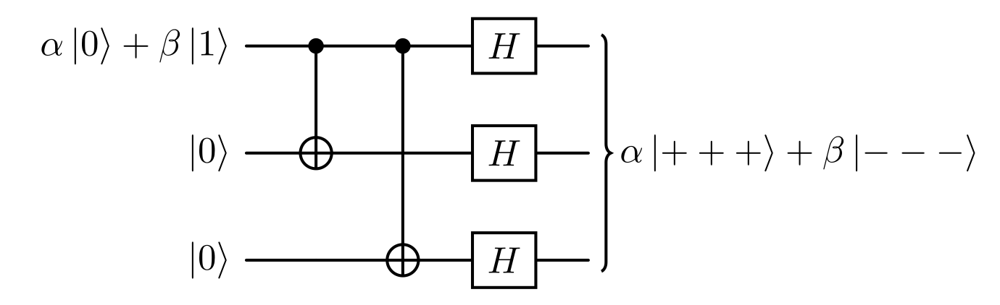

# Codici di ripetizione classici

Il rumore è una sfida fondamentale nei sistemi di elaborazione delle informazioni. Molti sistemi classici sono in grado di evitarlo completamente, mentre altri devono utilizzare codici di correzione degli errori per proteggersi dai suoi effetti. L'idea chiave è la ridondanza: codificando i messaggi con informazioni aggiuntive, gli errori possono essere rilevati e corretti anche se parte dei dati è corrotta. I codici di ripetizione sono esempi estremamente basilari di codici per la correzione degli errori.

## Procedure di codifica e decodifica

L'idea fondamentale è proteggere un bit dagli errori ripetendolo più volte. Si consideri il codice di ripetizione a 3 bit, in cui un singolo bit viene codificato come tre bit identici.

$$
\begin{aligned}
    0 &\mapsto 000 \cr
    1 &\mapsto 111 
\end{aligned}
$$
In assenza di errori, il bit originale può essere decodificato in modo banale. Tuttavia, anche se un solo bit viene invertito, il valore originale può comunque essere recuperato tramite votazione di maggioranza: il decodificatore restituisce il valore che appare più frequentemente.
$$
abc \mapsto majority(a,b,c)
$$
Questo corregge in modo affidabile gli errori a singolo bit.

Naturalmente, se 2 o 3 bit della codifica vengono invertiti, la decodifica non funzionerà correttamente e verrà recuperato il bit errato, ma se al massimo 1 dei 3 bit si inverte, la decodifica sarà corretta. Questo mostra un concetto centrale nella correzione degli errori: il compromesso tra ridondanza e robustezza.
## Analisi degli errori nei canali binari simmetrici

Ad esempio, supponiamo di voler comunicare un singolo bit a un ipotetico ricevitore attraverso un canale classico rumoroso. L'effetto del rumore nel canale è quello di invertire un bit trasmesso con probabilità $p$, mentre con probabilità $1-p$ il bit viene trasmesso correttamente. Un canale di questo tipo è noto come *canale binario simmetrico*, in quanto inverte ogni bit inviato in modo indipendente.

In questo contesto, se scegliamo di non utilizzare alcun codice di correzione degli errori e semplicemente inviamo un bit qualsiasi attraverso il canale, il ricevitore riceverà il bit errato con probabilità $p$.

D'altra parte, se prima utilizziamo il codice di ripetizione per codificare il bit e poi inviamo ciascuno dei tre bit risultanti attraverso il canale, ognuno di essi verrà invertito indipendentemente con probabilità $p$. Il ricevitore decodificherà correttamente solo se al massimo un bit viene invertito durante la comunicazione. Quindi la probabilità di un errore dopo la decodifica corrisponde alla probabilità che due o ciascuno dei tre bit si invertano durante la trasmissione. La probabilità totale di un errore è quindi
$$
3p^2(1-p)+p^3 = 3p^2-2p^3.
$$

Questo può essere calcolato utilizzando la teoria della probabilità. Supponiamo di indicare con
$$
p(X_1 \cap X_2 \cap X_3)
$$
la probabilità che, quando riceviamo la stringa di bit a 3 cifre, otteniamo il risultato $X_i$ per l'$i$-esimo bit, il cui valore può essere $C_i$ per un rilevamento corretto e $W_i$ per uno errato.

Consideriamo il caso in cui tutti e tre i bit siano errati, poiché i tre eventi sono indipendenti per ipotesi, la probabilità dell'intersezione degli eventi è il prodotto delle probabilità dei singoli eventi,
$$
p(W_1 \cap W_2 \cap W_3) = p(W_1) p(W_2) p(W_3) = p^3.
$$
Analizzando il caso in cui un solo bit viene ricevuto correttamente, vediamo che uno scenario possibile è il seguente:
$$
p(C_1 \cap W_2 \cap W_3) = p(C_1) p(W_2) p(W_3) = (1-p)p^2. $$
Ma può verificarsi anche questo (con lo stesso calcolo):
$$
p(W_1 \cap C_2 \cap W_3) = (1-p)p^2;
$$
e questo:
$$
p(W_1 \cap W_2 \cap C_3) = (1-p)p^2.
$$
L'espressione finale per l'evento di ricezione di un solo bit corretto è
$$
p\big((C_1 \cap W_2 \cap W_3) \cup (W_1 \cap C_2 \cap W_3) \cup (W_1 \cap W_2 \cap C_3)\big). $$

Poiché i tre eventi composti considerati hanno un'intersezione vuota (un bit non può essere contemporaneamente corretto e sbagliato), la teoria ci dice che possiamo semplicemente sommare le singole probabilità,
$$
\begin{aligned}
p& \big((C_1 \cap W_2 \cap W_3) \cup (W_1 \cap C_2 \cap W_3) \cup (W_1 \cap W_2 \cap C_3)\big) = \cr
&= p(C_1 \cap W_2 \cap W_3) + p(W_1 \cap C_2 \cap W_3) + p(W_1 \cap W_2 \cap C_3) = \cr
&=3(1-p)p^2.
\end{aligned}
$$

Infine, dobbiamo considerare l'evento composto: tutti i bit sono errati o un solo bit è corretto. Poiché questi hanno un'intersezione vuota, otteniamo
$$
\begin{aligned}
p&\Big( \big( (C_1 \cap W_2 \cap W_3) \cup (W_1 \cap C_2 \cap W_3) \cup (W_1 \cap W_2 \cap C_3)\big) \cup (W_1 \cap W_2 \cap W_3) \Big) = \cr
&= p^3 +3(1-p)p^2 =3p^2 -2p^3.
\end{aligned}
$$

Come si può vedere nella [figura sopra](#binary-symmetric-error), quando la probabilità di errore $p$ è inferiore a $1/2$, il codice di ripetizione riduce efficacemente la possibilità che il destinatario riceva un bit errato. Al contrario, se $p$ supera $1/2$, il codice amplifica la probabilità di decodificare erroneamente.
# Codici di Ripetizione Quantistica per i Qubit

Il codice di ripetizione a 3 bit può essere utilizzato anche per la correzione degli errori nei qubit.

## Codifica degli Stati Quantistici

Per creare uno stato ripetuto a 3 qubit, possiamo utilizzare il circuito mostrato nella [figura sotto](#3-qubit-bit-flip). Con questo circuito possiamo codificare lo stato generico $\alpha \ket{0}+ \beta \ket{1}$ nello stato $\alpha \ket{000}+ \beta \ket{111}$, grazie all'azione delle porte NOT controllate (CNOT).

Si noti che questa codifica è diversa dalla ripetizione dello stesso stato tre volte $\ket{\psi}\otimes\ket{\psi}\otimes\ket{\psi}$, cosa che sarebbe impossibile a causa del teorema di non clonazione.

## Rilevamento e correzione degli errori di inversione di bit

Il primo tipo di errore che possiamo correggere sfruttando qubit di ripetizione è l'inversione di bit. Questo tipo di errore è rappresentato da una porta $X$. Se uno dei tre qubit, diciamo quello centrale, subisce questo tipo di errore, lo stato finale del sistema sarebbe $\alpha \ket{010}+ \beta \ket{101}$. Per rilevare questo errore potremmo semplicemente misurare lo stato, ma ciò distruggerebbe la sovrapposizione.

Come possiamo capire quale dei tre qubit è stato invertito senza misurarne direttamente lo stato? Il modo corretto per farlo è aggiungere un nuovo elemento al nostro sistema. Questo dovrebbe essere un sistema inizialmente disaccoppiato dai nostri qubit, che entra in contatto con lo stato principale e ne viene influenzato in modo prevedibile, ma finisce comunque in uno stato disaccoppiato alla fine. Per disaccoppiamento si intende, in senso formale, quello che viene chiamato stato separabile. La proprietà principale di un sistema in uno stato separabile è che la misura di una delle sue porzioni non influenza il resto. Possiamo quindi sfruttare questa proprietà per dedurre, misurando il nuovo sistema, quale dei tre bit è stato invertito (supponendo di avere un solo inversione). Quindi applicando la porta $X$ inversa, cioè $X$ stessa in questo caso, al qubit che ha subito l'errore, possiamo ottenere nuovamente lo stato iniziale corretto.

Chiarito questo, e ricordando che misurando $n$ qubit possiamo ottenere $2^n$ diversi esiti, abbiamo bisogno solamente di due qubit aggiuntivi in grado di indicizzare i $2^2 = 4$ possibili risultati:

- 00 se non ci sono errori;

- 01 se il bit con errore è il terzo;

- 10 se il bit con errore è il primo;

- 11 se il bit con errore è il secondo.

Ora, vediamo come possiamo progettare un circuito che rispetti tutte le premesse. Consideriamo il nostro stato iniziale come
$$
\alpha \ket{000} + \beta \ket{111}. $$
Ad esempio, se si verifica un errore sul primo qubit, si ottiene lo stato
$$
\alpha \ket{100} + \beta \ket{011}.
$$
Ora, possiamo provare a utilizzare alcune porte, ad esempio le C-NOT, per fare in modo che questa modifica influisca sui due qubit aggiuntivi. Possiamo farlo come mostrato nella [figura seguente](#correcting-an-error-on-the-first-qubit).

Applicando quella porta CNOT, indicata come ${CX}_{i \to j}$, dove l'$i$-esimo qubit è quello di controllo, otteniamo

$$
\begin{aligned}
CX_{1\to4} \left( (\alpha \ket{100} + \beta \ket{011}) \otimes \ket{00} \right) = \cr
= CX_{1\to4} (\alpha \ket{100} \otimes \ket{00}) + CX_{1\to4} (\beta \ket{011} \otimes \ket{00}) = \cr
= \alpha \ket{100} \otimes \ket{10} + \beta \ket{011} \otimes \ket{00}
\end{aligned}
$$

dove abbiamo sfruttato la linearità nel secondo passaggio. Notiamo che il CNOT ha agito solo sulla prima parte del nostro stato di sovrapposizione. Tuttavia questo non è lo stato che vogliamo ottenere alla fine perché non è separabile, cioè non possiamo esprimerlo nella forma
$$
\begin{aligned}
(\alpha \ket{100}+ \beta \ket{011} ) \otimes \ket{10}
\end{aligned}
$$
Quest'ultimo è ciò che vorremmo ottenere, poiché vogliamo misurare gli ultimi due qubit e ottenere la stringa $10$, che indica un errore sul primo qubit, senza perturbare il nostro stato originale (i primi tre qubit).

Dobbiamo quindi modificare la seconda parte dello stato in uscita dal [circuito precedente](#correcting-an-error-on-the-first-qubit), quella legata al coefficiente $\beta$, per ottenere $\beta \ket{011} \otimes \ket{10}$. Come possiamo farlo? Poiché il termine $\alpha$ ha il primo qubit impostato a $1$, possiamo applicare un CNOT al secondo o al terzo qubit senza modificare quella parte dello stato. Quindi possiamo applicare il CNOT al secondo come mostrato nella [seguente figura](#correcting-an-eotfq-2).

|correcting-an-eotfq-2")

In questo modo, applicando la porta, otteniamo
$$
\begin{aligned}
CX_{2\to4} \big( \alpha \ket{100} \otimes \ket{10} + \beta \ket{011} \otimes \ket{00} \big) = \cr
= CX_{2\to4} (\alpha \ket{100} \otimes \ket{10}) + CX_{2\to4} (\beta \ket{011} \otimes \ket{00}) = \cr
= \alpha \ket{100} \otimes \ket{10} + \beta \ket{011} \otimes \ket{10} = \cr
= \big( \alpha \ket{100} + \beta \ket{011} \big) \otimes \ket{10}
\end{aligned}
$$
Questo è esattamente lo stato che cercavamo.

Se ora consideriamo un errore sul terzo qubit come nell'[immagine sopra](#error-on-the-third-qubit), che risulta nello stato
$$
\alpha \ket{001} + \beta \ket{110},
$$
vediamo che il nostro circuito non funziona correttamente. Infatti,
$$
\begin{aligned}
CX_{2\to4} CX_{1\to4} \big( (\alpha \ket{001} + \beta \ket{110}) \otimes \ket{00} \big) = \cr
= CX_{2\to4} CX_{1\to4} (\alpha \ket{001} \otimes \ket{00}) + CX_{2\to4} CX_{1\to4} (\beta \ket{110} \otimes \ket{00}) = \cr
= \alpha \ket{001} \otimes \ket{00} + \beta \ket{110} \otimes \ket{00} = \cr
= \big( \alpha \ket{001} + \beta \ket{110} \big) \otimes \ket{00}. \end{aligned}
$$

Si noti che in questo caso, il CNOT che agisce sul primo termine della sovrapposizione (il termine $\alpha$) non fa nulla, mentre il secondo termine risulta in due inversioni consecutive che si annullano a vicenda. Quindi, in questo caso, l'azione delle porte è equivalente all'identità, non si ottiene alcuna informazione sull'errore. Possiamo correggere questa situazione aggiungendo altre porte CNOT; come nella situazione precedente, dobbiamo aggiungerne due per avere uno stato separabile, come mostrato nella [prossima figura](#error-corrected-on-the-third-qubit).

In questo modo, si ottiene il risultato $01$ in caso di errore sul terzo qubit. Si ricordi che i primi due CNOT si comportano come l'identità in questa situazione.

Se torniamo al caso precedente, quello con l'errore sul primo qubit, vediamo che la situazione è simmetrica: le due porte che abbiamo aggiunto alla fine agiscono come l'identità, mentre le prime due agiscono come descritto in precedenza; tutto funziona ancora. Inoltre, questo circuito agisce sullo stato di assenza di errore come l'identità.

L'ultimo caso che dobbiamo analizzare è l'[errore sul qubit centrale](#error-on-the-second-qubit). Vogliamo, in questo caso, ottenere il risultato $11$. Vediamo cosa succede con il circuito attuale. Notiamo che il primo e l'ultimo CNOT agiscono solo sulla parte $\beta$ della sovrapposizione. Quelli centrali, invece, agiscono solo sulla parte $\alpha$. Se controlliamo, otteniamo lo stato separabile desiderato:
$$
\big( \alpha\ket{010}+\beta\ket{101} \big) \otimes \ket{11}.
$$
Il nostro circuito funziona!

Riassumendo, possiamo facilmente calcolare i risultati della misurazione (*sindromi*) per tutti gli stati ottenuti da al massimo un bit-flip; li elenchiamo nella tabella seguente.

| Stato | Sindrome |
|:-------------------------------------:|:--------:|
| $\alpha \ket{000}+ \beta \ket{111}$ | 00 |
| $\alpha \ket{100}+ \beta \ket{011}$ | 10 |
| $\alpha \ket{010}+ \beta \ket{101}$ | 11 |
| $\alpha \ket{001}+ \beta \ket{110}$ | 01 |

È importante sottolineare che gli errori di inversione di bit perfetti sono solo un modello semplice di un fenomeno molto più complesso; qui abbiamo ipotizzato una singola inversione rappresentata da un operatore unitario. Discuteremo degli errori non unitari alla fine dell'articolo.

## Gestione degli errori di inversione di fase

Un altro tipo fondamentale di errore di cui dobbiamo preoccuparci sono gli errori di inversione di fase, modellati come porte $Z$. Applicando una porta $Z$ a uno qualsiasi dei tre qubit della codifica precedente, otteniamo
$$
(\mathbb{I}\otimes Z \otimes \mathbb{I})(\alpha \ket{000}+ \beta \ket{111})=\alpha \ket{000}- \beta \ket{111}. $$
Si scopre che le inversioni di fase su uno qualsiasi dei tre qubit hanno lo stesso effetto sull'intero stato finale, portando a un'inversione di fase totale per un numero dispari di porte $Z$ applicate. Sfortunatamente il nostro precedente circuito di correzione degli errori non è in grado di rilevare errori di inversione di fase: l'uscita nei qubit ancilla sarà comunque $00$, senza rilevare alcun errore.

## Codice di ripetizione modificato per la mitigazione dell'inversione di fase

Per rilevare errori di inversione di fase, dobbiamo modificare lo stato codificato $\alpha \ket{000}+ \beta \ket{111}$ applicando tre porte Hadamard, raggiungendo quindi lo stato $\alpha \ket{+++}+ \beta \ket{---}$. Questo viene fatto dal circuito nella [figura sotto](#3-qubit-phase-correcting-diagram-first-part). 

Dopo questa codifica, un errore di inversione di fase trasformerà uno stato $\ket{+}$ in uno $\ket{-}$ e viceversa. Quindi, aggiungendo due qubit ancilla nello stato $\ket{+}$, saremo in grado di riprodurre un circuito analogo a quello realizzato per le inversioni di bit, rappresentato nel [diagramma seguente](#3-qubit-complete-phase-correcting-diagram).

Come in precedenza, la sindrome misurata ci dirà se e dove si è verificato l'errore.

La correzione degli errori di inversione di fase ci impone quindi un cambio di base, effettuato tramite le porte di Hadamard.

# Il codice Shor a 9 qubit

Il codice  di Shor a 9 qubit è ottenuto combinando il codice di ripetizione a 3 bit per gli errori di inversione di bit e di fase descritto in precedenza.

## Struttura del codice e codifica

I due codici di correzione degli errori appena visti saranno concatenati, dando origine a un circuito a 9 qubit. Questi due codici possono essere applicati in qualsiasi ordine, qui abbiamo scelto di applicare prima il codice di correzione degli errori di inversione di fase (codice esterno); i qubit risultanti saranno poi codificati utilizzando il codice di ripetizione per gli errori di inversione di bit (codice interno), esattamente come nella [figura seguente](#9-qubit-shor-code-circuit-diagram).

In questo modo, l'azione risultante del circuito sugli stati base dei qubit originali è la seguente:
$$
\begin{aligned}
\ket{0} &\mapsto \frac{1}{2\sqrt{2}}(\ket{000}+\ket{111})\otimes(\ket{000}+\ket{111})\otimes(\ket{000}+\ket{111}) \cr
\ket{1} &\mapsto \frac{1}{2\sqrt{2}}(\ket{000}-\ket{111})\otimes(\ket{000}-\ket{111})\otimes(\ket{000}-\ket{111}). \end{aligned}
$$

## Propagazione degli errori e operazioni delle porte CNOT

Ora, prima di vedere come gli errori influenzano la nostra codifica, dobbiamo fermarci e introdurre alcune importanti relazioni ed equivalenze riguardanti gli errori $X$ e $Z$. Le seguenti equivalenze possono essere verificate calcolando le moltiplicazioni di matrici o scrivendo le tabelle della verità per [porte X](#relazioni-porte-x-e-porte-cnot) e [porte Z](#relazioni-porte-z-e-porte-cnot) con il CNOT.

## Correzione degli errori di inversione di bit

Considerando un errore di inversione di bit che interessa il nostro circuito, possiamo concentrarci su ciascuno dei tre blocchi separatamente. È facile vedere che ognuno di essi è la codifica di un singolo qubit utilizzando il codice di ripetizione per gli errori di inversione di bit, quindi sfruttando due qubit ancilla per blocco possiamo misurare e correggere fino a un errore di inversione di bit in ogni blocco.

## Correzione degli errori di inversione di fase

Poiché il codice progettato per correggere le inversioni di fase non è direttamente influenzato dagli errori, mostrare le capacità del codice Shor di rilevare anche questo tipo di errori sarà più difficile dato il nostro ordine di codifica.

Supponendo che un errore $Z$ interessi uno dei 9 qubit, possiamo usare le equivalenze introdotte in precedenza per dimostrare che è equivalente a un errore di inversione di fase verificatosi prima della codifica interna, come mostrato [sotto](#phasefliperrorfigure).

Quindi un errore $Z$ che si verifica in uno qualsiasi dei tre qubit all'interno di un blocco ha lo stesso effetto sullo stato finale di un errore $Z$ che si verifica prima del codice interno.

Quello che possiamo fare per gestire gli errori di inversione di fase è modellare l'errore $Z$ come se si verificasse prima del codice interno; quindi decodificare quest'ultimo per tornare alla prima fase della codifica. Ora il nostro qubit originale è semplicemente codificato utilizzando il codice di ripetizione per le inversioni di fase. In questo modo, possiamo semplicemente utilizzare due qubit ancilla come in precedenza per verificare la correttezza del nostro stato, e quindi codificare nuovamente ciascuno dei tre qubit con il codice di inversione di bit. La sindrome rileverà il blocco in cui si è verificata l'inversione di fase, come mostrato nella [prossima figura](#shor_correct_z).

Alla fine, è possibile semplificare il circuito precedente utilizzando quattro porte CNOT in meno, come nella [figura sotto](#shor_correct_z_simplified).

## Correzione simultanea degli errori di bit e di inversione di fase

Abbiamo appena visto come sia gli errori $X$ che $Z$ possano essere rilevati e corretti utilizzando il codice Shor. Consideriamo ora lo scenario in cui si verificano simultaneamente sia un errore di inversione di bit che un errore di inversione di fase, possibilmente sullo stesso qubit; vedremo che il codice Shor è in grado di gestire questo scenario senza ulteriori modifiche.

Poiché le matrici degli errori $X$ e $Z$ sono anticommutabili:
$$
XZ = \begin{pmatrix}0&1\cr1&0\end{pmatrix} \begin{pmatrix}1&0\cr0&-1\end{pmatrix}=
\begin{pmatrix}0&-1\cr1&0\end{pmatrix}=-\begin{pmatrix}1&0\cr0&-1\end{pmatrix}\begin{pmatrix}0&1\cr1&0\end{pmatrix}=-ZX
$$
invertendole si ottiene solo un fattore di fase globale irrilevante di $-1$. Quindi, indipendentemente dall'ordine in cui si verificano gli errori, siamo sempre in grado di propagare l'errore $Z$ fino a prima del codice interno. A questo punto è importante notare che le procedure per rilevare ed eventualmente correggere gli errori di inversione di bit e di fase possono essere eseguite indipendentemente introducendo un numero sufficiente di qubit ancillari, quindi possiamo semplicemente applicare prima la procedura per rilevare l'errore $X$ e poi quella per rilevare l'errore $Z$ per ripristinare infine lo stato iniziale corretto. Per essere precisi, l'ordine in cui vengono eseguite le procedure non è affatto importante, poiché le porte $X$ su uno qualsiasi dei nove qubit della codifica commutano con tutte le porte del circuito semplificato per correggere gli errori di inversione di fase ([Figura precedente](#shor_correct_z_simplified)); quindi anche invertendo l'ordine delle procedure entrambi gli errori verranno rilevati correttamente.

## Robustezza contro gli errori casuali

Prima di considerare gli errori quantistici arbitrari, analizziamo le prestazioni del codice Shor a 9 qubit quando si verificano errori casuali rappresentati da matrici di Pauli sui qubit.

Consideriamo un semplice modello di rumore in cui gli errori colpiscono i qubit indipendentemente con probabilità p, analogamente al canale binario simmetrico nei sistemi classici. Per semplicità, ipotizziamo che non ci siano correlazioni tra gli errori. Sebbene probabilità distinte possano essere assegnate agli errori X, Y e Z, ci concentriamo sullo scenario peggiore per il codice Shor: gli errori Y. Poiché gli errori Y equivalgono a errori simultanei X e Z a meno di un fattore di fase globale, essi rappresentano sia errori di inversione di bit che di fase.

Supponiamo di codificare un qubit logico utilizzando il codice Shor: l'esistenza di un vantaggio dipende dalla probabilità di errore p. Analogamente al classico codice a ripetizione a 3 bit, che diventa svantaggioso quando p>1/2, anche per il codice Shor possiamo trovare tale soglia e quantificarne le prestazioni.

Il codice Shor a 9 qubit è in grado di correggere qualsiasi errore di Pauli su un singolo qubit, inclusi gli errori $Y$, ma fallisce se si verificano più errori $Y$ su qubit diversi. Poiché nel nostro scenario ci concentriamo sugli errori $Y$, il codice è affidabile e protegge il nostro qubit logico finché al massimo uno dei qubit fisici è affetto da un errore, il che si verifica con probabilità
$$
(1-p)^9 + 9p(1-p)^8.
$$
Altrimenti, il codice fallisce con probabilità
$$
1-(1-p)^9-9p(1-p)^8.
$$

Non è certo che il verificarsi di più errori di Pauli porti a una decodifica errata dello stato originale del qubit, ma ai fini di questa analisi consideriamo questo scenario come un fallimento. Diciamo che in questo caso un errore logico ha interessato il nostro qubit logico. D'altra parte, se non utilizziamo il codice, il nostro singolo qubit fisico subisce errori logici con probabilità $p$, quindi il codice offre un vantaggio reale solo per $p$ tale che
$$
1-(1-p)^9-9p(1-p)^8<p.
$$

Come possiamo vedere nella [figura sopra](#shor_performance), la soglia per il codice Shor a 9 qubit è di circa $0,0323$. Se $p$ è inferiore al valore precedente, il codice è utile, riducendo la probabilità che si verifichi un errore, ma se $p$ è maggiore della soglia, non dovremmo utilizzarlo poiché peggiorerebbe la robustezza al rumore del nostro sistema rispetto a un singolo qubit fisico.

# Discretizzazione degli errori nei sistemi quantistici

Il codice Shor a 9 qubit corregge errori quantistici arbitrari, non solo errori $X$ o $Z$, sfruttando la sua capacità di correggere separatamente gli errori $X$ e $Z$. Questo funziona perché qualsiasi possibile errore a singolo qubit può essere scomposto in una combinazione di $X$, $Z$ o entrambi (una proprietà nota come *discretizzazione degli errori*). Poiché il codice rileva e corregge gli errori $X$ e $Z$ in modo indipendente, gestisce intrinsecamente anche tutti gli altri errori. Pertanto, non sono necessari meccanismi aggiuntivi: correggere $X$ e $Z$ è sufficiente per proteggere dal rumore quantistico arbitrario. Innanzitutto, ci concentriamo sugli errori unitari.

## Modellazione degli errori unitari dei qubit

Il codice Shor a 9 qubit può correggere *qualsiasi* errore unitario a singolo qubit, anche quelli che non sono prossimi all'identità (ad esempio, piccole rotazioni o operazioni unitarie arbitrarie). Sebbene possa sembrare difficile correggere un numero infinito di possibili errori, l'intuizione chiave è che qualsiasi operatore unitario $U$ a singolo qubit può essere scomposto in una combinazione lineare di operatori di Pauli:
$$
U = α I + β X + γ Y + δ Z
$$
dove $Y = iXZ$.

Quando si verifica un errore $U_k$ sul $k$-esimo qubit, lo stato corrotto diventa una sovrapposizione dello stato originale e degli stati con errori $X_k$, $Z_k$ o $X_kZ_k$. Durante il rilevamento dell'errore, le misurazioni della sindrome collassano probabilisticamente questa sovrapposizione in uno dei casi di errore di Pauli (o nel caso nessun errore), con le relative probabilità $|\alpha|^2$, $|\beta|^2$, $|\gamma|^2$ e $|\delta|^2$. La sindrome rivela quale errore si è verificato, consentendone la correzione. Sorprendentemente, questo processo funziona anche per errori minuscoli, poiché le misurazioni della sindrome discretizzano l'errore in un'operazione di Pauli, che il codice è progettato per correggere. Dopo la correzione, il sistema torna allo stato codificato originale, rimuovendo di fatto l'entropia introdotta dall'errore. Questo dimostra la *discretizzazione degli errori*: errori unitari arbitrari vengono ridotti a errori di Pauli correggibili attraverso la misurazione della sindrome.

Il codice Shor a 9 qubit corregge errori unitari arbitrari attraverso la discretizzazione degli errori. Per gli errori multi-qubit, rappresentiamo formalmente le operazioni utilizzando prodotti tensoriali con matrici identità. Utilizzando la numerazione dei qubit di Qiskit $(Q_8,Q_7,...,Q_0)$, le operazioni a singolo qubit si estendono allo spazio a 9 qubit come:

$$
\begin{aligned}
X_0 &= I^{\otimes 8} \otimes X = I\otimes I\otimes I\otimes I\otimes I\otimes I\otimes I\otimes I\otimes X\cr
Z_4 &= I^{\otimes 4} \otimes Z \otimes I^{\otimes 4}=I\otimes I\otimes I\otimes I\otimes Z \otimes I\otimes I\otimes I\otimes I \cr
U_7 &= I \otimes U \otimes I^{\otimes 7} =I\otimes U\otimes I\otimes I\otimes I\otimes I\otimes I\otimes I\otimes I
\end{aligned}
$$

dove $I^{\otimes n}$ denota un prodotto tensoriale di $n$ matrici identità. Un errore unitario arbitrario $U_k$ sul qubit $k$ si scompone in operatori di Pauli come:
$$
U_k = \alpha I^{\otimes 9} + \beta X_k + \gamma Y_k + \delta Z_k
$$

con $X_k$, $Z_k$ definiti in modo simile alle [precedenti definizioni di operatori](#operator-definitions) e $Y_k = iX_kZ_k$. Per errori multipli, il formalismo si estende naturalmente:
$$
U_{j,k} = (I^{\otimes (8-j)} \otimes U_j \otimes I^{\otimes j}) \cdot (I^{\otimes (8-k)} \otimes U_k \otimes I^{\otimes k})
$$

La misurazione della sindrome proietta questi errori continui su operatori di Pauli discreti. Ad esempio, un errore a due qubit $U_{2,5}$ collasserebbe in uno tra $I$, $X_2$, $Z_5$, $X_2Z_5$, ecc., con probabilità determinate dai coefficienti di decomposizione. La struttura del prodotto tensoriale garantisce la corretta identificazione dei qubit interessati attraverso il pattern della sindrome.
$$
\xi \otimes \ket{\psi}\bra{\psi}
$$
dove
$$
\begin{aligned}
\xi &= |\alpha|^2 \ket{I \text{ sindrome}}\bra{I \text{ sindrome}}\cr
&+ |\beta|^2 \ket{X_k \text{ sindrome}}\bra{X_k \text{ sindrome}}\cr
&+ |\gamma|^2 \ket{X_kZ_k \text{ sindrome}}\bra{X_kZ_k \text{ sindrome}}\cr
&+ |\delta|^2 \ket{Z_k \text{ sindrome}}\bra{Z_k \text{ sindrome}}.
\end{aligned}
$$

## Errori arbitrari generali sui qubit

Ora esaminiamo gli errori arbitrari (non necessariamente unitari) sui qubit. Nello specifico, modelliamo l'errore utilizzando un canale quantistico generico $\Phi$, che potrebbe rappresentare vari processi di rumore, come sfasamento, depolarizzazione, operazioni di reset o persino canali non convenzionali e meno studiati.

Per analizzare $\Phi$, lo esprimiamo innanzitutto in termini di operatori di Kraus:
$$
\Phi(\sigma) = \sum_j A_j \sigma A_j^\dagger,
$$
dove ogni $A_j$ è una matrice $2 \times 2$. Poiché le matrici di Pauli costituiscono una base per tali operatori, espandiamo ogni $A_j$ come:
$$
A_j = \alpha_j I + \beta_j X + \gamma_j Y + \delta_j Z.
$$
Questa decomposizione ci permette di riscrivere l'azione di $\Phi$ su un qubit target $k$ in termini di errori di Pauli:
$$
\begin{aligned}
\Phi_k \big( \ket{\psi}\bra{\psi} \big) &= \sum_j \big( \alpha_j I_k + \beta_j X_k + \gamma_j Y_k + \delta_j Z_k \big) \ket{\psi}\bra{\psi} \cr
&\quad \times \big( \alpha_j I_k + \beta_j X_k + \gamma_j Y_k + \delta_j Z_k \big)^\dagger.
\end{aligned}
$$
In sostanza, abbiamo riformulato gli operatori di Kraus come combinazioni lineari di operatori di Pauli.

Misurando la sindrome di errore e applicando la correzione appropriata, lo stato risultante assomiglia al caso di errore unitario, sebbene con una miscela più complessa:
$$
\xi \otimes \ket{\psi}\bra{\psi},
$$
dove $\xi$ ora incorpora i contributi di tutti i termini di Kraus:
$$
\begin{aligned}
\xi &= \sum_j \Big( |\alpha_j|^2 \ket{I \text{ sindrome}}\bra{I \text{ sindrome}} \cr
&\quad + |\beta_j|^2 \ket{X_k \text{ sindrome}}\bra{X_k \text{ sindrome}} \cr
&\quad + |\gamma_j|^2 \ket{X_kZ_k \text{ sindrome}}\bra{X_kZ_k \text{ sindrome}} \cr
&\quad + |\delta_j|^2 \ket{Z_k \text{ sindrome}}\bra{Z_k \text{ sindrome}} \Big).
\end{aligned}
$$

Sebbene la derivazione esplicita coinvolga più termini, il principio di base rimane identico allo scenario unitario: l'estrazione e la correzione della sindrome proiettano l'errore in componenti di Pauli distinguibili.
## Estensioni e generalizzazioni

La discretizzazione degli errori si estende naturalmente a codici di correzione degli errori quantistici più generali, inclusi quelli in grado di rilevare e correggere errori su più qubit. In tali scenari, gli errori multi-qubit possono essere rappresentati come prodotti tensoriali di matrici di Pauli:
$$
E = \bigotimes_{k=1}^n P_k \quad \text{dove} \quad P_k \in \{I, X, Y, Z\},
$$
e sindromi distinte identificano le corrispondenti correzioni di Pauli che potrebbero dover essere applicate simultaneamente a più qubit, anziché a un singolo qubit.

Attraverso la misurazione delle sindromi, gli errori vengono effettivamente proiettati su un insieme discreto di possibilità caratterizzate da questi prodotti tensoriali di Pauli. Applicando le correzioni appropriate, possiamo ripristinare lo stato codificato originale. La casualità introdotta durante questo processo è limitata ai qubit delle sindromi, che vengono successivamente scartati o ripristinati. Questo meccanismo rimuove efficacemente la casualità generata dal sistema contenente le informazioni codificate, preservando l'integrità del calcolo quantistico.

Il principio fondamentale rimane coerente con il caso a singolo qubit: la correzione degli errori procede attraverso:

1. Identificazione delle sindromi di errore tramite misurazione;

2. Determinazione delle corrispondenti correzioni di Pauli;

3. Isolamento della casualità nei qubit ausiliari che vengono poi rimossi
dal sistema.

Questo approccio mantiene le caratteristiche essenziali della correzione degli errori quantistica, pur consentendo la scalabilità verso modelli di errore multi-qubit più complessi.